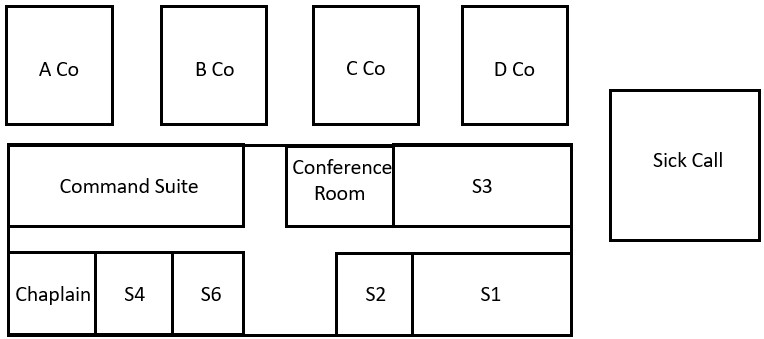

```{r setup, message=FALSE, echo=TRUE, include=FALSE, warning=FALSE}
knitr::opts_chunk$set(echo = TRUE)
colorize <- function(x, color) {
  if (knitr::is_latex_output()) {
    sprintf("\\textcolor{%s}{%s}", color, x)
  } else if (knitr::is_html_output()) {
    sprintf("<span style='color: %s;'>%s</span>", color, 
      x)
  } else x
}
# `r colorize("...", "blue")`
```

\newcommand{\sol}[1]{\color{teal}  #1 \color{black}} 

<!-- xcolor standard colors: 
black, blue, brown, cyan, darkgray, green, lime, magenta, olive, orange, red, purple, teal, violet, yellow, etc.  -->


# MA256 Lesson 5 - Generalization (2.1, 2.2)

## Warm up

Match the following symbols with their definitions:
$\quad \pi \quad \mu \quad \hat{p} \quad \bar{x} \quad s \quad \sigma$

1.  Which symbol represents the *population's* parameter for a categorical variable?
    `r colorize("$\\pi$. ", "blue")`

2.  Which represents the *sample's* average for a quantitative variable?
    `r colorize("$\\bar{x}$. We can calculate it with 'mean(x)' in R.", "blue")`

3.  Which represents the *population's* standard deviation for a quantitative variable?
    `r colorize("$\\sigma$", "blue")`

4.  Which represents the *sample's* proportion for a categorical variable?
    `r colorize("$\\hat{p}$", "blue")`

5.  Which represents the *sample's* standard deviation for a quantitative variable?
    `r colorize("$s$", "blue")`

6.  What does the last remaining symbol represent?
    `r colorize("$\\mu$ is the population's average for a quantitative variable.", "blue")`

## Definitions

-   **generalization**

`r colorize("How broadly the conclusions apply. It is to which, if any, larger group of individuals our results may apply to outside of the assessed sample.", "blue")`
\vfill

-   **population**

`r colorize("Indicated by $N$. The population is the entire set of observational units of a certain group", "blue")`
\vfill

-   **sample**

`r colorize("Indicated by $n$. Some smaller subset of a larger population", "blue")`
\vfill

-   **convenience sample**

`r colorize("A nonrandom sample of a population which often tends to oversample a certain group within the population while undersampling others.", "blue")`
\vfill

-   **biased sampling method**

`r colorize("A sampling method which tends to consistently overestimate or underestimate the population parameter of interest.", "blue")`
\vfill

-   **simple random sample**

`r colorize("A random sample which ensures each observational unit has the same chance of being selected in the sample. Typically done through a Random Number Generator, pulling names from a hat, rolling dice, etc.", "blue")`
\vfill


## Questions

Q1) Does a larger sample size fix sampling bias?

`r colorize("No. Larger sample size will not fix a biased sampling method.", "blue")` \vfill

Q2) What are some Non-sampling concerns which might also introduce bias into our data?

`r colorize("Some examples might include the wording of a question, lack of anonymity, extreme phrasing, uncalibrated scales, time of day, intimidation, etc.", "blue")`
\vfill

Q3) How do you calculate the standard deviation for a sample proportion (from a large population)? The standard deviation of a sample mean (for a large sample)? 

`r colorize("$SD(\\pi) = \\sqrt{\\pi (1-\\pi) / n}; \\qquad SD(\\bar{x}) = \\frac{\\sigma}{\\sqrt{n}}$", "blue")`
\vfill 

\newpage

## Scenario:

You've been assigned to the Battalion S3 shop as the AS3. The BC comes in one day and asks you to
give him a snapshot of the health of the soldiers of the Battalion. Here is a schematic of your Battalion area: 

{width="4in"}

You decide to sample the 20 Soldiers in your immediate vicinity and discover none of them are sick.


Q4) What is the population?

`r colorize("Everybody assigned to the Battalion", "blue")`
\vfill 

Q5) What is the sample?

`r colorize("The 20 Soldiers you asked, who belong as a part of the Battalion", "blue")`
\vfill 

Q6) What kind of sample did you just take?

`r colorize("This is known as a convenience sample.", "blue")`
\vfill 


Q7) Is this type of sample biased or unbiased? 

`r colorize("This type of sample is biased.", "blue")`
\vfill 


Realizing that perhaps your sample is too small for the entire battalion, you walk over to the S1 office and ask 10 more of those Soldiers to get a more representative sample. None of them report being sick.

Q8) Will asking the Soldiers in the S1 shop (10 more not sick) fix the bias?

`r colorize("No – increasing n does not fix a biased sampling method", "blue")`
\vfill 


Luckily, the CSM stopped you before you went in with the BC. After his blood pressure came back down he told you that he knows for a fact that some Soldiers went to sick call this morning, so you decide to call over to the aid station to expand your sample. You discover that 10 Soldiers from your unit are currently there. Given the 20 healthy S3 Soldiers, 10 healthy S1 Soldiers, and these 10 sick soldiers, you determine your sample proportion is 25\% sick.

Q9) Is this new proportion representative of the population?

`r colorize("No. it’s possible some sick call were released for the day", "blue")`
\vfill 

This time the XO stops you. He suggests that you randomize your sample and try again. You use R to pick 20 random numbers that identify Soldiers on the recall roster. By texting each one to ask if they are sick or not, you learn 2 out of the 20 went to sick call. 

Q10) What is your new unbiased and representative proportion and what symbol would you use to represent it? 

`r colorize("$\\hat{p} = 0.1$", "blue")`
\vfill 

Q11) Knowing this won’t exactly match the population proportion, how do we get a closer estimate? 

`r colorize("Collect a few more random samples of 20 observations, and average the proportions.", "blue")`
\vfill 

\newpage


## Gettysburg Address

(Note: Reference Exploration 2.1 (p. 126) and 2.2 (p. 138) )


\textbf{1}. Select a representative set of 10 words from the Gettysburg Address passage by circling them.

*Four score and seven years ago our fathers brought forth on this continent, a new nation, conceived in Liberty, and dedicated to the proposition that all men are created equal. Now we are engaged in a great civil war, testing whether that nation, or any nation so conceived and so dedicated, can long endure. We are met on a great battlefield of that war. We have come to dedicate a portion of that field, as a final resting place for those who here gave their lives that that nation might live. It is altogether fitting and proper that we should do this. But, in a larger sense, we cannot dedicate -- we cannot consecrate -- we cannot hallow -- this ground. The brave men, living and dead, who struggled here, have consecrated it, far above our poor power to add or detract. The world will little note, nor long remember what we say here, but it can never forget what they did here. It is for us the living, rather, to be dedicated here to the unfinished work which they who fought here have thus far so nobly advanced. It is rather for us to be here dedicated to the great task remaining before us -- that from these honored dead we take increased devotion to that cause for which they gave the last full measure of devotion -- that we here highly resolve that these dead shall not have died in vain -- that this nation, under God, shall have a new birth of freedom -- and that government of the people, by the people, for the people, shall not perish from the earth.*

\vspace{0.25in}
\textbf{2}. Record each word from your sample and then indicate the length of the word (number of letters) and whether or not the word contains at least one letter "e".

\begin{table*}[h!]
\begin{center}
\begin{tabular}{|c|c|c|c|}
\hline
\textbf{} & \textbf{Word} & \textbf{Length of Word (number of letters)} & \textbf{Contains \textit{e}? (Y or N)}\\
\hline
1 & \; \; \; \; \; \; \; \; \; \; \; \; \; \; &  & \\
\hline
2 &  &  & \\
\hline
3 &  &  & \\
\hline
4 &  &  & \\
\hline
5 &  &  & \\
\hline
6 &  &  & \\
\hline
7 &  &  & \\
\hline
8 &  &  & \\
\hline
9 &  &  & \\
\hline
10 &  &  & \\
\hline
\end{tabular}
\end{center}
\end{table*}


\textbf{3.} Identify the observational units and the variables you have recorded on those observational units. (Keep in mind that observational units do not have to be people!)

\sol{The Observational Units are each word (each of the 10 rows of our dataset table above, which the other variables describe or are an attribute of).\\
The variables here are Length of the Word (quantitative) and contains \textit{e} (categorical).}

\vfill

\textbf{4.}	Is the variable “length of word” quantitative or categorical?

\sol{It is quantitative}

\vfill

\textbf{5.}	Calculate the average length of the 10 words in your sample and write it below.\\
Is this number a parameter or a statistic?

\sol{Answers will vary; this is a statistic, a summary of our sample, it is what we saw in our data.}

\vfill

\textbf{6.}	The average length of the 268 words in the entire speech equals 4.295 letters. Is this number a parameter or a statistic? 

\sol{This is a parameter, it is the true mean of the population.}

\vfill

\textbf{7.}	Calculate the proportion of words in your sample that contain at least one “e” and write it below. \\
Is this number a parameter or a statistic? 

\sol{Answers will vary; this is a statistic, a summary of our sample, what we each saw in our data.}

\vfill

\textbf{8.}	The proportion of all words in the entire speech that contain at least one letter “e” is $\frac{125}{268} \approx 0.466$. Is this number a parameter or a statistic? 

\sol{This is a parameter, the true proportion of the population.}

\vfill

\textbf{9.} Compare the sample statistics with the population parameters. 

\hspace{0.1in}\textbf{a)} How many and what proportion of cadets obtained a sample average word length larger than the population parameter?

\sol{Answers may vary, but in general, there will be bias.}

\vfill

\hspace{0.1in} \textbf{b)} How many and what proportion of cadets obtained a sample proportion of "e" words larger than the population parameter?

\sol{Answers may vary, but in general, there will be bias.}

\vfill

\textbf{10.} Do our results indicate that our sampling method is biased? Explain.

\sol{(Normally) Yes, there is a bias to choose longer words and a higher proportion of words with 'e'}

\vfill

\textbf{11. }Do you think that closing our eyes and pointing blindly at a page with a pencil 10 times would result in
a biased sample? Explain.

\sol{Yes, longer words take up more space on the page and are more likely to be selected with this method.}

\vfill

\textbf{12. } Do you think that selecting 20 words instead of 10 would remove any bias in the previous two methods?
Explain.

\sol{No, increasing sample size does not fix a biased sampling method. The additional samples are just as likely to be biased towards longer words.}

\vfill


The following code will read in the Gettysburg address, remove commas and periods, calculate the length of each word, and indicate whether or not a word contains the letter "e". The final result is a dataframe called `GW`. 

```{r}
library(tidyverse)

gw <- scan('http://www.isi-stats.com/isi/data/chap3/GettysburgAddress.txt', character(), quote ="")

gw <- gw %>% gsub(",", "", x=. ) %>% gsub("\\.", "", x=.)
GW <- data.frame(words = gw) %>% 
  mutate(wordlen = str_length(words), 
         cont.e = grepl("e", words))
```


\textbf{13. } What is another technique for selecting 10 words from the population that might be a better representation of the population with regards to word length and "e" words?

\sol{Answers may include a random number generator, folded up papers with words pulled from a hat, rolling a 268 sided dice, etc.}

\vfill

\textbf{14. } In R, use \color{blue} sample(1:268, 10) \color{black} to randomly sample 10 numbers between 1 and 268 (without replacement). The table below identifies each number and which word it corresponds to. Use this to fill out the table.


\begin{table*}[htbp]
\begin{center}
\begin{tabular}{|c|c|c|c|}
\hline
\textbf{} & \textbf{Word} & \textbf{Length of Word (number of letters)} & \textbf{Contains \textit{e}? (Y or N)}\\
\hline
1 & \; \; \; \; \; \; \; \; \; \; \; \; \; \; &  & \\
\hline
2 &  &  & \\
\hline
3 &  &  & \\
\hline
4 &  &  & \\
\hline
5 &  &  & \\
\hline
6 &  &  & \\
\hline
7 &  &  & \\
\hline
8 &  &  & \\
\hline
9 &  &  & \\
\hline
10 &  &  & \\
\hline
\end{tabular}
\end{center}
\end{table*}


\textbf{15.}	Calculate the average length of the 10 words in your new sample and write it below.
How does this compare to your previous sample?

\sol{Answers will vary, but should be closer to the population mean of 4.295}

\vfill

\textbf{16.}	Calculate the proportion of words in your new sample that contain at least one “e” and write it below.
How does this compare to your previous sample?

\sol{Answers will vary, but should be closer to the population mean of 0.466}

\vfill

\textbf{17.} Compare the sample statistics with the population parameters. 

\hspace{0.1in}\textbf{a)} How many and what proportion of cadets obtained a sample average word length larger than the population parameter?

\sol{Answers will vary, but should be roughly half}

\vfill

\hspace{0.1in} \textbf{b)} How many and what proportion of cadets obtained a sample proportion of "e" words larger than 0.466?

\sol{Answers will vary, but should be roughly half}

\vfill

\textbf{18. } Did our new simple random sample show evidence that it is a biased sampling method?

\sol{No.}

\vfill

\textbf{19. } Do we meet the validity conditions for estimating strength of evidence? What are the implications?

\sol{ No, we do not have 10 success and 10 failures in our samples, so we cannot assess strength of evidence through theory alone, we would need to simulate.}

\vfill


