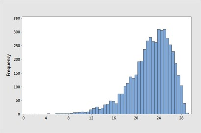

```{r setup, message=FALSE, echo=TRUE, include=FALSE, warning=FALSE}
knitr::opts_chunk$set(echo = TRUE)
```

\newcommand{\sol}[1]{\color{violet}  #1 \color{black}} 

<!-- xcolor standard colors: 
black, blue, brown, cyan, darkgray, green, lime, magenta, olive, orange, red, purple, teal, violet, yellow, etc.  -->


# MA256 Lesson 6 - Generalization (2.3, 2.4)

## Warm up (quiz)

1.  What are the 3 S's in the 3S Strategy?

\sol{Statistic, Simulate, Strength of Evidence}
<!-- \vfill -->

2.  What are the 4 elements used to describe a distribution?

\sol{1-Shape, 2-Center, 3-Variability, \& 4-Unusual Observations. (See P-2, p. 10)}
<!-- \vfill -->

3.  Describe the shape of the following distribution and determine whether the mean or median better represents the Center.

{width="200"}

\sol{This distribution is slightly left skewed. For skewed distributions, the mean is pulled in the direction of the skew, so the median is better for defining the Center.}


4. What are two ways to measure the strength of evidence for a single categorical variable?  

\sol{Calculate the P-value or Z-statistic (standardized statistic). Simulate with One Proportion Applet or Theory-Based method.}
<!-- \vfill -->

5. What are the two ways to measure strength of evidence for a single quantitative variable? 

\sol{Calculate the P-value or t-statistic (standardized statistic). Simulate with One Mean Applet or Theory-Based method.}
<!-- \vfill -->

6. What is the point of Central Limit Theorem (CLT)? Build the table below showing validity conditions by scenario & key formula.

\begin{table*}[h!]
\begin{center}
\begin{tabular}{|p{1.5in}|p{2.0in}|p{2.0in}|p{1.0in}|}
\hline
\textbf{Applications} & \textbf{Validity Conditions} & \textbf{Formula} & \textbf{Example}\\ \hline
Endless Random Process with Fixed Probability of Success (Categorical Vars) & 
\sol{$\ge 10$ success and $\ge10$ failures in sample. } &
\sol{Calculate standard deviation of $\hat{p}$: $s= \sqrt{\pi(1-\pi)/n}$ } & 
\sol{flipping a coin} \\  \hline
Sampling from a Population (Categorical Variables)  & 
\sol{$\ge 10$ success and $\ge10$ failures in sample AND population is $\ge20\times$ sample size. } &  
\sol{Calculate standard deviation of $\hat{p}$: $s= \sqrt{\pi(1-\pi)/n} $} & 
\sol{boxing uniform color example (Expl. 1.4)}\\  \hline
Sampling from a Population (Quantitative Variables)  &
\sol{Symmetric Distribution -OR- $\ge 20$ Observations AND Sample Distribution is not Strongly Skewed} &
\sol{Calculate t-statistic on a Population Mean: $t = \frac{(\bar{x} - \mu_0)}{s/\sqrt{n}}$ } &
\sol{\# of sick-call Soldiers in your BN}\\  \hline
\end{tabular}
\end{center}
\end{table*}

\sol{Bypass simulation and jump straight to strength of evidence using intuitive $\pi$ or $\mu_0$ and a formula for $s$.}
<!-- \vfill -->


 

## ACFT, IOCT, and APFT Dataset

Load the ACFT Dataset posted on Microsoft Teams. This constitutes data collected on or about 2019 (pre-Covid) from randomly selected cadets in 1st Regiment on physical fitness and includes APFT, IOCT, and ACFT performance. Researchers were curious to know how cadets performed physically on various tests, specifically if they were above average. We will conduct analysis on all three tests.


```{r message=FALSE, error=FALSE}
library(tidyverse)
# ACFT <- read_csv("ACFT1.csv")
ACFT <- read_csv("https://raw.githubusercontent.com/jkstarling/MA256/main/data/ACFT1.csv")
```

<!-- \vfill -->

We can begin exploring our available data to see what variables are captured.
```{r}
head(ACFT)
colnames(ACFT)
```
<!-- \vfill -->


1. What are the observational units in this study?

\sol{Each individual cadet}
<!-- \vfill -->


2. What are some categorical and quantitative variables of interest? List and classify some of interest.

\sol{Some variation, but a categorical could be "Sex", quantitative could include age, IOCT$\_$Score, AFCT$\_$score, etc.}
<!-- \vfill -->


### APFT

The APFT is scored with 3 events on a 100 point scale, where 60 is passing in each of the three events (pushup, situp, and 2 mile run). If a Soldier scores at least 100 points on each event, they can push past 300 to an "extended scale," but if any event falls beneath the 100 point threshold then the "additional" points are lost. It has been suggested that the Corps of Cadets had an average APFT score of 270, and we want to assess if this is true.

#### Step 1: Ask a Research Question \

\textbf{A.3)} What is the research question?

\sol{Is the Corps of Cadets average APFT score equal to 270 or not?}

<!-- \vfill -->


\textbf{A.4)} Based on these questions, what is the population of interest?

\sol{The population of interest is the Corps of Cadets}

<!-- \vfill -->

#### Step 2: Design a Study and Collect Data\

\textbf{A.5)} What is our null and alternate hypothesis, stated in both words and symbols?

\sol{$H_0: \mu = 270$. The true mean APFT score for the Corps of Cadets is 270.\\
$H_a: \mu \ne 270$. The true mean APFT score for the Corps of Cadets is not 270.}

<!-- \vfill -->


\textbf{A.6)} What is our variable of interest? Is it categorical or quantitative?

\sol{Our variable of interest is APFT$\_$score, which is a quantitative variable.}

<!-- \vfill -->


\textbf{A.7)} Based on the classification in \textbf{6}, what theory-based test will we conduct? (hint: z or t)

\sol{A quantitative variable will conduct a single-mean test with the \textit{t} statistic.}
<!-- \vfill -->


#### Step 3: Explore the Data\

\textbf{A.8)} Use R to create a histogram of the APFT scores and describe the shape, center, variability, and any unusual observations. (Check the Tidyverse Tutorial for reference.)

```{r out.width = "40%"}
ACFT %>% ggplot(aes(x = APFT_score)) + 
  geom_histogram() + 
  labs(x = "Overall Score", y="Count", title="Cadet APFT Scores")
```

\sol{The shape appears to have two peaks split at the 300 cutoff point, which makes sense due to the grading rules. It has a mean at 304 and median at 296, indicating some right skew. Our standard deviation is 29.1, with values ranging from about 225 up to 275.}

<!-- \vfill -->


\textbf{A.9)} Calculate the mean, median, standard deviation, and sample size of the ACFT scores. Include the proper notation as appropriate.  (Check the Tidyverse Tutorial for reference.)

```{r}
ACFT %>% summarise(mean = mean(APFT_score), 
                   median = median(APFT_score), 
                   s = sd(APFT_score), 
                   n = n())
```

\sol{From the code above, we find that 
mean = $\mu$ = 303.5\\
median = 296 \\
standard deviation = \textit{s} = 29.1\\
sample size = \textit{n} = 293}

<!-- \vfill -->


#### Step 4: Draw Inferences Beyond the Data\

\textbf{A.10)} Have we met our validity conditions to use theoretical methods? Why or why not?

\sol{Yes, for quantitative data we have more than 20 observations and the data is not strongly skewed.}

<!-- \vfill -->


\textbf{A.11)} Assume we met our validity conditions. Using theory, calculate the appropriate standardized statistic.

```{r}
t <- (304-270) / (29.1 / sqrt(293))
t
```

\sol{ $t = \frac{304 - 270}{\frac{29.1}{\sqrt{293}}}$ = 19.99953}

<!-- \vfill -->


\textbf{A.12)} Calculate the appropriate p-value using the theoretical method and standardized statistic from \textbf{11}.

```{r}
2*(1 - pt(abs(t), 292))
```

\sol{$2*(1 - pt(abs(19.99953), 292)) = 0$}

<!-- \vfill -->

\textbf{A.13)} Comment on the strength of evidence as it applies to our null and alternate hypotheses.

\sol{With a p-value of (computationally) 0, we have very strong evidence that the true mean of corps of cadets APFT scores is not equal to 270.}

<!-- \vfill -->

#### Step 4: REDUX (using the median)\

\textbf{A.14)} After looking at your figure and summary statistics above (A.8 and A.9), does it make sense that the mean is higher than the median APFT score? Explain why the mean and median have this relationship. 

\sol{Yes, it makes sense since the distribution is slightly right skewed. The larger values in the right tail will "pull up" the mean.}
<!-- \vfill -->

\textbf{A.15)} The largest APFT score in the data was 375 points. What would happen to the mean if the score was incorrectly recorded as 475? What would happen to the median? 

\sol{The mean would increase, while the median would remain the same.}
<!-- \vfill -->

\textbf{A.16)} For this dataset, the difference between the mean and median is not large, but we still might consider the median a more appropriate statistic to focus on, as it would represent a *typical* score, rather than the mean score which is being pulled to the right by a few large percentages. The problem is, all the theory you saw in Sections 2.2 and 2.3 only applies to means. So how can we get a sense for how much sample-to-sample variation there is in the sample medians? How does this work? 

\sol{Yes... bootstrap!\\ Resampling works as such: given a set X = \{250, 275, 300\}, one sample could be \{300, 275, 275\}; another \{250, 300, 300\}; and another \{250, 250, 250\}; .... etc. \\ Using the bootstrap will allow us to estimate the standard deviation/variance of the data (that may be non-normal).}
<!-- \vfill -->


\textbf{A.17)} Is it plausible that this sample came from a population with a population median of 270 points? Use the bootstrap to answer. Do we see a difference between the bootstrapped mean and median?

```{r out.width = "40%"}
set.seed(256)
M <- 1000
apft.scores <- ACFT$APFT_score
n <- length(ACFT$APFT_score)

RES <- data.frame(res.med = rep(NA, M),
                  res.mean = rep(NA, M))

for(i in seq(1:M)){
  x <- sample(apft.scores, n, replace = TRUE)
  RES$res.med[i] <- median(x)
  RES$res.mean[i] <- mean(x)
}
# calculate the difference between the mean (under null hypothesis) and the observed median (your data)
my.high.median <- median(ACFT$APFT_score)  # 296
my.shift <- my.high.median - 270
my.low.median <- 270 - (my.high.median - 270)

RES %>% ggplot(aes(x=res.mean-my.shift)) + geom_histogram()
RES %>% ggplot(aes(x=res.med-my.shift)) + 
  geom_histogram() + 
  geom_vline(xintercept= my.high.median, linetype="dashed", color = "red") + 
  geom_vline(xintercept= my.low.median, linetype="dashed", color = "red")
( sum(RES$res.med-my.shift > my.high.median) + 
    sum(RES$res.med-my.shift < my.low.median)) / M
```

\sol{It does not look to be very plausible that the median APFT score is 270. Our estimated p-value is 0. }


#### Step 5: Formulate Conclusions\

\textbf{A.18)} Do you feel comfortable generalizing the results of your analysis to all Army cadets (USMA, ROTC, G2G)? Explain your reasoning.

\sol{No, those observational units did not have an equal chance of being selected and so we cannot generalize these results.}

<!-- \vfill -->


\textbf{A.19)} Do you feel comfortable generalizing the results of your analysis to the Corps of Cadets? Explain your reasoning.

\sol{No,  observational units from different regiments did not have an equal chance of being selected and so we cannot generalize these results to populations outside of 1st REG.}

<!-- \vfill -->


\textbf{A.20)} What population could you generalize your results to? Explain your reasoning.

\sol{We can generalize these results to the 1st Regiment population of cadets, as those cadets had an equal probability of being sampled for this study.}

<!-- \vfill -->


\textbf{A.21)} How confident are you to say that we have proven the alternate hypothesis?

\sol{We never say we proved or disproved a hypothesis, only that we have very strong evidence against the null hypothesis.}

<!-- \vfill -->


#### Step 6: Look Back and Ahead  \

\textbf{A.22)} Suggest how you might redesign the experiment to allow you to draw a more broad conclusion.

\sol{To generalize to the USMA Corps of Cadets, we would randomly sample from the entire population of the corps of cadets instead of just one regiment. To generalize to all cadets, we would need to be able to randomly sample from the Corps of Cadets, ROTC, and G2G populations with equal probability per cadet.}
<!-- \vfill -->

\textbf{A.23)} Suppose your research question had an alternate hypothesis for a one-sided test. That is, do USMA cadets, on average, perform better than 270? Report your new alternate hypothesis, p-value  and the significance of your findings. Is this surprising?
```{r}
 1 - pt(t, 292)
```

\sol{$H_a: \mu > 270; \; \; \; 1 - pt(19.99953, 292)) = 0$\\
This is not surprising, it should be half the two-sided test, and $\frac{1}{2}$ of 0 is 0.}
<!-- \vfill -->

\textbf{A.24)} Suppose you wanted to assess the data for only males or only females. Repeat your original ($\ne$) }\\analysis with the proper subsets and report on your findings.
```{r}
ACFT %>% group_by(Sex) %>% summarise(mn = mean(APFT_score), sd = sd(APFT_score), n=n())
t.m <- (301-270) / (28.6/ sqrt(234)); t.m
t.f <- (312-270) / (29.4 / sqrt(59)); t.f
# (males, females)
c(1-pt(t.m,234), c(1-pt(t.f,59))) 
```

\sol{MALES: $t = \frac{301 - 270}{\frac{28.6}{\sqrt{234}}}$ = 16.58073, p-value $\approx$ 0}\\
\sol{FEMALES: $t = \frac{313 - 270}{\frac{29.4}{\sqrt{59}}}$ = 11.23433, p-value = 2.22e$^{-16}$}
 
 \newpage
 
 
## Heavy Backpacks

Carrying a heavy backpack can be a source of ``chronic, low-level trauma,'' and can cause long-lasting shoulder, neck, and back pain. The American Academy of Orthopedic Surgeons recommends that a backpack not weigh more than 10 to 15% of the wearer’s body weight. As the problem of over heavy backpacks has received more attention recently among primary and secondary school students, a student group decided to investigate the issue with students at their own university (approximately 20,000 enrolled students). Twenty-five students were sampled from each of four locations across the campus, during the course of four days, and four different times of the day (early morning, lunch time, evening, late afternoon). Scales were used to measure backpack weight to the nearest pound, and students were asked to report their body weight on a survey. One researcher was the designated talker and introduced the survey to the participants (survey questions included major, year in school, whether have back problems, and gender). Another person in the group was in charge of reading the scale, and another in charge of gathering the surveys.

**B.1)** Based on the study description, phrase a research question that you would be interested in testing with these students’ data. Be sure to identify the population and parameter of interest. What symbol could you use for this parameter?


\sol{Answers will vary. For example: Do University students carry backpacks that weigh more than 10% of the owner’s body weight? The population of interest is university students and the parameter of interest is the average percentage of body weight for backpacks in the population, $\mu$}


**B.2)** The data in `backpack.xls` contain several variables of interest, including backpack weight. But the recommendation was stated in terms of “percentage of person’s weight,” so we first convert this variable into the percentage of body weight for each individual in the dataset.
```{r}
backpack <- read_csv("https://raw.githubusercontent.com/jkstarling/MA256/main/data/Backpack.csv")

backpack$perc <- backpack$BackpackWt / backpack$BodyWt * 100
# backpack <- backpack %>% mutate(perc = backpack$BackpackWt / backpack$BodyWt * 100)
```


**B.3)** Describe the distribution of the percentages for this sample of 100 students. Remember to focus on shape, center, and variability, and any unusual observations or outliers.

```{r}
backpack %>% ggplot(aes(x=perc)) + geom_histogram(bins=10)
backpack %>% summarise(mn = mean(perc),
                       sd = sd(perc))
```

\sol{The shape of the percentage of body weight for the 100 backpacks is slightly skewed to the right, it is centered at a mean of 7.713, and has a standard deviation of 3.664 There do not appear to be any unusual observations.}


**B.4)**  Predict how the median percentage will compare to the mean percentage, keeping in mind that the median will divide the dataset in half, 50 students below the median and 50 students above the median.
```{r}
median(backpack$perc)
```
\sol{Answers will vary, you might predict the median will be larger as we have a large fraction of the distribution around smaller percentages}


**B.5)** The largest percentage in this dataset is 18.1%. Suppose this had been incorrectly recorded as 181%! How will the mean change? How will the median change?
\sol{The mean will greatly increase, but the median will remain the same.}


**Is it plausible that this sample came from a population with a population median of 10%?**

**B.6)**  State appropriate null and alternative hypotheses, in words, about the population median for this research question. Assume a one-sided hypothesis test. 

\sol{Null hypothesis: Long-run median percentage of weight for backpacks is 10%, Alternative hypothesis: Long-run median percentage of weight for backpacks is less than 10%}


The code below provides a bootstrap simulation to estimate the median percentage of backpack weight. 
```{r out.width = "50%"}
set.seed(256)

M <- 1000
RES <- data.frame(res.med = rep(NA, M),
                  res.mean = rep(NA, M))
n <- 100

for(i in seq(1:M)){
  x <- sample(backpack$perc, n, replace = TRUE)
  RES$res.med[i] <- median(x)
  RES$res.mean[i] <- mean(x)}

my.median <- 7.143  #obs. median
my.shift <- 10 - my.median


RES %>% ggplot(aes(x=res.med + my.shift)) + 
  geom_histogram() + 
  geom_vline(xintercept= my.median, linetype="dashed", color = "red")
```


**B.7)** Estimate the p-value using the results of the bootstrap simulation.   
```{r}
# estimated p-value
sum(RES$res.med + my.shift <= my.median) / M
```

**B.8)**  Write a paragraph summarizing your conclusions from this study. Be sure to discuss both what you learned from the sample and what you believe to be plausible about the population.

\sol{Based on the sample median, there is evidence that median percentage of body weight for backpacks in the population of university students is different than 10%, in fact there is evidence that the population median is less than 10%.}


**B.9)**  Return to your critique of the study design. If you were to carry out such a study on your own campus, discuss what you would do differently and why.

\sol{It would be better to have a random sample of students, it would also be nice to have the backpacks weighed in the same spot each time so that surface differences wouldn’t affect the scale’s measurements.}


