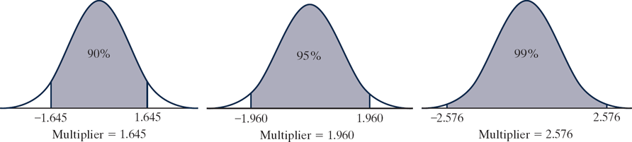

```{r setup, message=FALSE, echo=TRUE, include=FALSE, warning=FALSE}
knitr::opts_chunk$set(echo = TRUE)
```


# MA256 Lesson 7 - Estimation - How large is the effect? (3.1-3.4)

## Warm up (quiz) - Exploration 2.3

### Q1) Research Question: How much do students at your school sleep on a typical night? Let’s make the question more specific and ask about last night. Is the average less than the recommended eight hours? How can we estimate this population average?

\vfill

 
### Q2) *(circle one word for each pair)* Convenience sampling may be (biased/unbiased) whereas simple random sampling is (biased/unbiased).
\vspace{0.1in}

### Q3) One class conducted this study and recorded their sleep times (http://www.isi-stats.com/isi/data/chap2/SleepTimes.txt). Summarize the shape, center (mean with appropriate symbol and measurement units), and variability (standard deviation with appropriate symbol and measurement units) for the sample of sleep times for your class. Also be sure to discuss any unusual observations or outliers in the data.

```{r message=FALSE, error=FALSE, out.width = "30%"}
# library(tidyverse)
# sleep <- read.table("http://www.isi-stats.com/isi/data/chap2/SleepTimes.txt", header = TRUE)
# sleep %>% summarise(...)
# sleep %>% ggplot(....)
```

\vfill


### Q4) Do these data provide any preliminary evidence that students at your school tend to sleep less than 8 hours a night?

\vfill

### Q5) Calculate the standardized statistic using the theory based approach for a one-sample t-test.  Is it surprising to get a sample mean like the one you calculated 

```{r}
# xbar <- xxx
# s <- xxx
# mu0 <- xxx
# n <- xxx
# 
# tstat <- xxxx
# tstat
# pt(xxxx) # p-value
# pnorm(xxxx)
```

\vfill 

\newpage


## Chapter 3 Overview

### Why should we care about the topics covered in Chapter 3?

So far, we can only say things like "We have strong evidence that the long-run probability Buzz pushes the correct button is larger than 0.5."  Is this as helpful as it could be? 

### 1) If we ask.... our answer is...

- Is ____ a plausible value for our parameter?  Answer: 

- What are all plausible values for our parameter? Answer:  

### 2) For the buzz study, is there a better answer we can come up with? 


### 3) Cutting the chase... when I walk out of class today, what do I need to know from Chapter 3? 

\vfill


### 4) Making sense of the three methods described in the book:
-1: plausible values method: 
\vspace{0.1in}

-2: 2SD: 
\vspace{0.1in}

-3: Theory based approach: 
\vfill

### 5) Looking at the equations above, what four things will affect the size of the confidence interval? 

\vfill


### 6) Where does the "2" come from in the 2SD method come from? Figure 3.2.3. shows the change in the multiplier with a change in the confidence level. We can see that at the 95\% confidence level, the multiplier is roughly 2. Use the `qnorm()` function to calculate the multiplier for a 90\%, 95\%, and 99\% confidence level.  Compare your answers with using the $t-distribution$ for a sample size of $n=20$.


{width="600"}

```{r}
# # 90%
# qnorm(xxx)
# qt(xxx)
# # 95%
# qnorm(xxx)
# qt(xxx)
# # 99%
# qnorm(xxx)
# qt(xxx)
```


\newpage


### 7) \hspace{0.1in}  According to a 2018 report by the U.S. Department of Labor, civilian Americans spend 2.84 hours per day watching television. A faculty researcher, Dr. Sameer, at California Polytechnic State University (Cal Poly) conducts a study to see whether a different average applies to Cal Poly students. Suppose that for a random sample of 100 Cal Poly students, the mean and standard deviation of hours per day spent watching TV turns out to be 3.01 and 1.97 hours, respectively. There is not strong skew.
\vspace{-0.3in}

\hspace{0.1in} \textbf{a)} Is our statistic quantitative or categorical?

\vfill

\hspace{0.1in} \textbf{b)} What is the value of our statistic (hint: $\hat{p} \; and/or \;  \bar{x} \; and/or \; s$)?

\vfill


\hspace{0.1in} \textbf{c)} Do we meet our validity conditions?

\vfill


\hspace{0.1in} \textbf{d)} What is our 95$\%$ Confidence Interval for the true mean hours that Cal Poly students spend watching television per day?
```{r}
# xbar <- xxx
# s <- xxx
# n <- 
# c(xxx, xxx)
```

\vfill


\hspace{0.1in} \textbf{e)} Given our confidence interval above, what do we know about the results of a strength of evidence test with a null hypothesis of $\mu = 2.84$ and an alternate hypothesis of $\mu \ne 2.84$?

\vfill

\hspace{0.1in} \textbf{f)} Report your standardized statistic (t or z) and p-value given the above data and a null hypothesis of $\mu = 2.84$ and an alternate hypothesis of $\mu \ne 2.84$.
```{r}
# mu <- xxx
# tstat <- xxx
```


\vfill


\hspace{0.1in} \textbf{g)}  Which of the following are INVALID interpretations of the 95\% CI? 

1. About 95\% of all CP students spend between 2.619 and 3.401 hours/day watching TV.
2. There is a 95\% chance that, on average, CP students spend between 2.619 and 3.401 hours/day watching TV.
3. We are 95\% confident that, on average, these 100 CP students spend between 2.619 and 3.401 hours/day watching TV.
4. In the long run, 95\% of the sample means will be between 2.619 and 3.401 hours.


\vfill


### 8)  Most  people  are  right  handed,  and  even  the  right  eye  is  dominant  for  most  people.  Developmental  biologists  have  suggested  that  late-stage  human  embryos  tend  to  turn  their  heads  to  the  right.  In  a  study  reported  in  Nature  (2003),  German  bio-psychologist  Onur  Güntürkün conjectured that this tendency to turn to the right manifests itself in other ways as well, so he studied kissing couples to see which side they leaned their heads to while kissing. He  and  his  researchers  observed  kissing  couples  in  public  places  such  as  airports,  train  stations, beaches, and parks in Germany. They were careful not to include couples who were holding objects such as luggage that might have affected which direction they turned. For each kissing couple observed, the  researchers noted whether the couple leaned their heads to the right or to the left. They observed 124 couples, ages 13 to 70 years.

\vspace{-0.3in}

\hspace{0.1in} \textbf{a)}  Identify the observational units in this study.  


\vspace{0.25in}

\hspace{0.1in}\textbf{b) } Identify the variable recorded in this study. Classify it as categorical or quantitative.

\vspace{0.25in}

\hspace{0.1in} \textbf{c) }  Suppose we want to know the true long-run proportion of couples that kiss right in Germany. Would this be a statistic or a parameter? What symbol is used to represent this proportion of the population?

\vspace{0.25in}

\hspace{0.1in} \textbf{d) }   Do we know the exact value of the long run proportion of couples kissing right based on the data? Explain.  

\vspace{0.25in}

\hspace{0.1in} \textbf{e) }  State the appropriate null and alternative hypotheses, both in words and in terms of the parameter $\pi$, for testing the conjecture that kissing couples tend to lean their heads to the right more often.


\vfill


\hspace{0.1in} \textbf{f) }   Calculate  the  sample  proportion  of  the  observed  couples  who  leaned  their  heads  to  the  right while kissing. Also indicate the symbol used to denote this value.

```{r message=FALSE, warning=FALSE, error=FALSE}
# library(tidyverse)
# library(janitor)
# kiss <- read_csv("https://raw.githubusercontent.com/jkstarling/MA256/main/data/Kissing.csv")
# kiss %>% count(Direction)
# phat <- xxx
# phat
```


\vfill

\hspace{0.1in} \textbf{g) } Do we meet the validity conditions to conduct a theoretical test? Justify your answer.


\vfill


\hspace{0.1in} \textbf{h) } If we wanted to do strength of evidence testing using theoretical methods, which test would we use?

\vfill

\newpage 


\hspace{0.1in} \textbf{i) } Use a theoretical test to assess the strength of evidence that the sample data provide for Güntürkün’s conjecture that kissing couples tend to lean their heads to the right more often than they would by random chance. Report the approximate p-value and summarize your conclusion about this strength of evidence.

```{r}
# pi <- xxx
# z <- xxx
# z
# xxxx # put p-value calculation here
```

\vfill


\hspace{0.1in} \textbf{j) }  Now use theoretical methods to test whether the data provide evidence that the probability that a couple leans their heads to the right while kissing ($\pi$) is different from 0.60. (Note that this question changes both the null hypothesis and the alternate hypothesis)  Report the standardized statistic, p-value, and comment on the strength of evidence. 

```{r}
# pi <- xxx
# z <- xxx
# z
# xxxx # put p-value calculation here
```

\vfill


\hspace{0.1in} \textbf{k)}  Using theoretical methods, calculate the 95$\%$ confidence interval. Interpret your results.
```{r}
# c(xxx, xxx)
```

\vfill


\hspace{0.1in} \textbf{l)} Does your confidence interval include 0.50? Does it include 0.60? Explain how your answers relate to the strength of evidence tests conducted in *i* and *j* above.

\vfill


\hspace{0.1in} \textbf{m) } Now  suppose  we  were  to  use  a  significance  level  of  0.01  instead  of  0.05. How would you expect the interval of plausible values to change: wider, narrower, or no change? Explain your reasoning. 


\vfill


\hspace{0.1in} \textbf{n) } Calculate the corresponding 99$\%$ confidence interval. Did it behave as expected?

```{r}
# c(xxx, xxx)
```


\vfill


\hspace{0.1in}  \textbf{o) } Based on your 99$\%$ confidence interval, what can be said about the p-value for testing a null hypothesis of 0.78?


\vfill
\hspace{0.1in} \textbf{p) } Can your results be generalized? Explain your reasoning.

\vfill

\pagebreak


