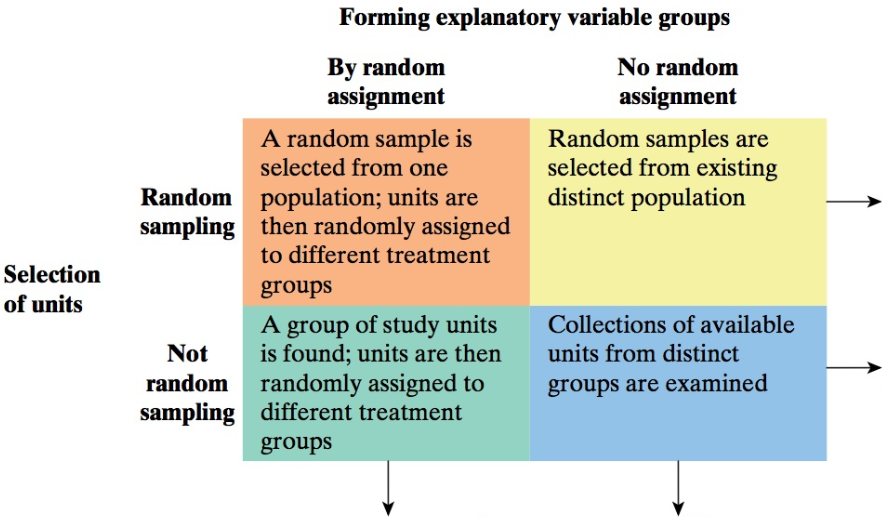

```{r setup, message=FALSE, echo=TRUE, include=FALSE, warning=FALSE}
knitr::opts_chunk$set(echo = TRUE)
```

\newcommand{\sol}[1]{\color{blue}  #1 \color{black}}

<!-- \renewcommand{\sol}[1]{} -->

<!-- xcolor standard colors: 
black, blue, brown, cyan, darkgray, green, lime, magenta, olive, orange, red, purple, teal, violet, yellow, etc.  -->

# MA256 Lesson 8 - Causation - Can we say what caused the effect? (4.1-4.2)

### Review:  In last class, we saw this picture: 

{width="600"}

### Q1) What is the confidence level and significance level associated with each figure? 

\sol{remember: significance is $\alpha$, while confidence is $1-\alpha$. \\
LEFT: confidence = 90\%, significance = 10\% \\
CENTER: confidence = 95\%, significance = 5\% \\
RIGHT: confidence = 99\%, significance = 1\%}

\vfill

### Q2) Explain how we calculate the critical value for the 95\% Confidence (e.g. 1.960) using the R command `qnorm(0.975)` or `qt(0.975, n-1)`. 

\sol{Draw picture (or point to middle picture) showing the area for the middle picture has 95\%. Since we are looking at a confidence of 95\%, the associated significance is 5\%. The 5\% is the total area under the distribution curve beyond the critical values (-1.960 and 1.960); so there is 2.5\% to the LEFT and 2.5\% to the RIGHT. The `qnorm(a)` function will return the `(standardized statistic) value that contains $a$ percent/probability under the curve`. To get the RIGHT critical value, we are looking for the value that gives us 2.5\% + 95\% = 97.5\% under the curve. Thus, we evaluate `qnorm(0.975)`. Likewise, we could find the LEFT critical value by calculating `qnorm(0.025)`}
```{r  eval=FALSE}
c(qnorm(0.975), qnorm(0.025))
c(qt(0.975, n-1), qt(0.025, n-1))
```
\vfill

### Q3) In LSN04 (\S 1.3-1.5) we saw the following guidelines for evaluating strength of evidence. Explain how these guidelines are related to the figures above. 

\begin{tabular}{c|p{4.0cm} | p{4.0cm}}
 & p-value  & standardized test-stat \\ \hline  
Weak Evidence against the null 
& $0.1 < p$   
& $|z| \le 1.5$    \\ 
Moderate Evidence against the null 
& $0.05 < p \le 0.1$ 
& $1.5 < |z| \le  2$    \\
Strong Evidence against the null 
& $0.01 < p \le  0.05$ 
& $2 < |z| \le 3$   \\
Very Strong Evidence against the null 
& $p \le 0.01 $ 
& $|z| > 3 $
\end{tabular}

\vfill 


### (Bonus - 2pts) Show how we can use the equation for the confidence interval to either "fail to reject" OR "reject" the null hypothesis, given (1) the t-statistic ($t=\frac{\bar{x} - \mu}{s/\sqrt{n}}$) and (2) a critical value ($t^*$) for a reasonable confidence level. 

\vspace{-0.1in} 

Hint: We will fail to reject the null hypothesis if $|t| < t^*$ and we  reject the null hypothesis if $|t| \ge t^*$

\sol{Assuming $|t| < t^*$ we have: \\
$-t^* < \frac{\bar{x} - \mu}{s/\sqrt{n}} < t^*$ \\
$-t^* \cdot s/\sqrt{n} < \bar{x} - \mu < t^* \cdot s/\sqrt{n}$ \\
$- \bar{x} -t^* \cdot s/\sqrt{n}  <  - \mu < - \bar{x} + t^* \cdot s/\sqrt{n}$ \\
$\bar{x} -t^* \cdot s/\sqrt{n}  > \mu > \bar{x} - t^* \cdot s/\sqrt{n} $ \\
Thus we will fail to fail to reject $H_0$ if: $|\mu| < \bar{x} \pm t^* \cdot s/\sqrt{n}$ \\
Likewise we will will reject $H_0$ if $|t| \ge t^*$ since $|\mu| \ge \bar{x} \pm t^* \cdot s/\sqrt{n}$ }


\newpage

## Causation 

### 1) What does it mean when two variables are *associated* (or *related*)?  What variables are associated in this picture? (see https://www.tylervigen.com/spurious-correlations for more)

{width="500"}

\sol{We can see that per capita cheese consumption are associated with deaths by being tangled in their bedsheets.}
\vfill

### 2) What is an explanatory variable? What is a response variable? With the picture above, which is the explanatory/response variable? 

\sol{An explanatory variable is a variable that we think is explaining the change in the response variable. \\
A response variable is a variable that we think is being impacted/affected/changed by the explanatory variable.\\
Depends - we could call either one an explanatory or response variable depending upon our study question.}
\vfill


### 3) What is a confounding variable? Can you think of any examples of confounding variables from the cheese and bedsheets example? 

\sol{A variable that influences both the explanatory and response variables and makes it 
difficult to know if the observed association was legitimate or due to confounders.\\
Various answers for the cheese/bedsheet example. These two are not generally related at all, so coming up with confounders may be hard to determine. }

\vfill

### 4) To help provide insight to when we can determine cause and effect or inference, fill in the following table. 

{width="400"}

\sol{from L-R: Can draw cause and effect conclusions. Potential for confounding variables. Potential for sampling bias. Inference to populations can be drawn. }

\newpage


### 4) Does height provide an advantage for IOCT Completion Times? Run this code below in RStudio and discuss. Do you think there may be a confounding variable?  (change `eval=FALSE` to `eval=TRUE`)

```{r warning=FALSE, message=FALSE,  out.width = '40%', eval=TRUE}
library(tidyverse)

# IOCT_Data <- read_csv("IOCT_Data_Cleaned.csv") # un-comment if you don't have internet access
IOCT_Data <- read_csv("https://raw.githubusercontent.com/jkstarling/MA256/main/data/IOCT_Data_Cleaned.csv")
```

```{r warning=FALSE, message=FALSE,  out.width = '40%', eval=FALSE}
#Graph IOCT Data Height vs IOCT Time
IOCT_Data %>% 
  ggplot(aes(x = height, y=IOCT_Time))+
  geom_point() + #Scatter Plot when comparing two quantitative variables
  geom_smooth(method="lm")+ #Overlays the best-fitting line for the data 
  labs(x="All Heights", y="All IOCT Times")
```

\vfill


### 5) Run this code below in RStudio and discuss. What did we change compared with above?  What other variables may be confounding? (change `eval=FALSE` to `eval=TRUE`)

```{r warning=FALSE, message=FALSE,  out.width = '40%', eval=TRUE}
IOCT_Data %>%
  ggplot(aes(x = height, y=IOCT_Time, color=as.factor(sex)))+
  geom_point()+
  geom_smooth(method="lm")+
  labs(x="All Heights Colored by Sex", y="All IOCT Times Colored by Sex")
  
```

\vfill


### 6) "A Degree from West Point leads to higher earnings." Draw the causal diagram for this statement. What is the explanatory variable? What is the response variable? Can you think of any confounding variables  that may invluence your ability to get into West Point AND influence your ability to earn money? 


\sol{SOL: Draw a diagram with WP arrow to earning \$\$. Some confounding variables could be parents education/income, race, gender, branch, combat experience, command, connections, ability, ???}


\vfill 

\newpage 


### 7) An undergrad Psychology student at Creighton University wants to investigate whether Netflix usage by U.S. college students results in a lower GPA. She intends to conduct a survey of her junior classmates, then connect their responses to whether their GPAs rose or fell at the end of the semester.

### a) Is this an observational study or experiment? Why?


\sol{This is an observational study since researchers are observing what happens naturally and are not manipulating or controlling how much Netflix students watch.}


### b) What is the explanatory variable? Is it categorical or quantitative? What is the response
variable? Is it categorical or quantitative?

\sol{Explanatory VAR: How Much Netflix students watch (assumed units = hours/day). Quantitative. \\
Response VAR: Whether a GPA rose or fell at the end of the semester. Categorical.}


### c) Will a cause-and-effect conclusion be possible? Why or why not?


\sol{Since this was an observational study, no cause and effect conclusions are possible. Only experiments with random assignment can result in cause and effect conclusions.}


### For the following questions, answer and provide your reasoning.


### 8) Is random sampling or random assignment the more important consideration if the research question is whether a waiter generates higher tips by giving his name when he first greets customers?


\sol{Random assignment would be more important since we are trying to assess whether giving your name results in larger tips. We would need to eliminate confounders via random assignment.}


### 9) Is random sampling or random assignment the more important consideration if the research question is whether faculty at West Point tend to drive older cars than Firsties?

\sol{Due to the shear number of faculty and Firsties with cars, randomly sampling would be more importantsince we could generalize the findings of the sample to all faculty and to all Firsties.}


### 10) In order to estimate the proportion of all voters who will likely vote for the incumbent in the city's upcoming mayoral race, a random sample of 500 likely voters is taken, finding that 320 say they will likely vote for the incumbent. The polling agency wishes to test whether there is evidence that more than 60 percent of likely voters will vote for the incumbent.

### a) Describe the parameter of interest in words.

\sol{Parameter: Pi is the long-run proportion of voters who will vote for the incumbent.}
\vfill


### b) State the null and alternate hypotheses using short-hand notation.

\sol{$H_0: \pi = 0.6$ \\
$H_a: \pi > 0.6$}
\vfill

### c) Is the theory-based approach appropriate? Why or why not?

\sol{Yes. We have at least 10 successes and at least 10 failures (320 successes and 180 failures). Also, since this is a city's election, the population is likely at least 20x greater than the sample size (20*500 = 10,000 voters).}
\vfill

### d) Calculate the p-value using theory-based approach, determine the strength of evidence, and formulate a conclusion based on a 0.05 level of significance.

```{r}
phat <- 320/500
pi <- 0.6
SD <- sqrt(pi*(1-pi)/500); SD
zstat <- (phat - pi) / SD; zstat
pval <- 1 - pnorm(zstat); pval
```

\sol{We have strong evidence against H0. Since the p-value is less than the significance level of 0.05, we conclude that there is strong evidence that more than 60\% of voters will vote for the incumbent.}
\vfill

### 11) Using the IOCT data file you read in above, answer the following questions. Assume that the APFT data was collected through a random selection method. Also assume that the histogram of the sit-up scores is a somewhat bell-shaped curve (Not strongly skewed). Create a 94\% confidence interval for the population average sit-up scores for all West Point cadets.


### a) Is the Theory-based Approach valid for this situation? Why or why not?

\sol{Since this is a quantitative variable, validity conditions are met because the problem told us to assume the histogram was not strongly skewed, and since we have at least 20 observations.}
\vfill

### b) Use R to create the 94 percent Confidence Interval for the population average sit-up score for all West Point cadets.

```{r}
alpha <- 0.06
xbar <- mean(IOCT_Data$su_score)
SD <- sd(IOCT_Data$su_score)
n <- length(IOCT_Data$su_score)
multiplier <- qt(1-alpha/2, n - 1)
c(xbar - multiplier * SD / sqrt(n), xbar + multiplier * SD / sqrt(n))
```


\vfill

### c) Is it plausible that the average sit-up score for all West Point cadets is 85 at a 0.06 level of significance?

\sol{Since 85 points is not inside the 94\% confidence interval, it is not a plausible value at the 0.06 significance level.}

\vfill