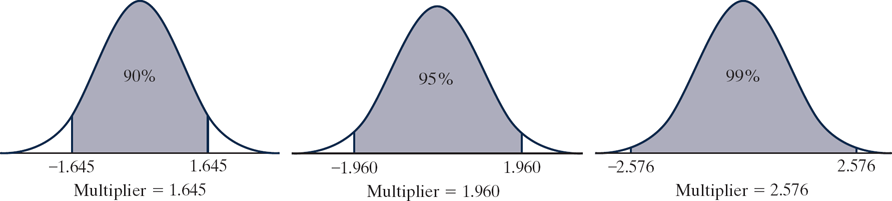

```{r setup, message=FALSE, echo=TRUE, include=FALSE, warning=FALSE}
knitr::opts_chunk$set(echo = TRUE)
colorize <- function(x, color) {
  if (knitr::is_latex_output()) {
    sprintf("\\textcolor{%s}{%s}", color, x)
  } else if (knitr::is_html_output()) {
    sprintf("<span style='color: %s;'>%s</span>", color, 
      x)
  } else x
}
# `r colorize("...", "blue")`
```

\newcommand{\sol}[1]{\color{teal}  #1 \color{black}}
<!-- \renewcommand{\sol}[1]{} -->


<!-- xcolor standard colors: 
black, blue, brown, cyan, darkgray, green, lime, magenta, olive, orange, red, purple, teal, violet, yellow, etc.  -->


# MA256 Lesson 7 - Estimation - How large is the effect? (3.1-3.4)

## Warm up (quiz) - Exploration 2.3

### Q1) Research Question: How much do students at your school sleep on a typical night? Let’s make the question more specific and ask about last night. Is the average less than the recommended eight hours? How can we estimate this population average?

\sol{Null hypothesis: The average length of time all students at your school slept last night was 8 hours; $H_0: \mu = 8$ \\
Alternative hypothesis: The average length of time all students at your school slept last night was less than 8 hours; $H_a: \mu < 8$}
\vfill

 
### Q2) *(circle one word for each pair)* Convenience sampling may be (biased/unbiased) whereas simple random sampling is (biased/unbiased).
\vspace{0.1in}

### Q3) One class conducted this study and recorded their sleep times (http://www.isi-stats.com/isi/data/chap2/SleepTimes.txt). Summarize the shape, center (mean with appropriate symbol and measurement units), and variability (standard deviation with appropriate symbol and measurement units) for the sample of sleep times for your class. Also be sure to discuss any unusual observations or outliers in the data.

```{r message=FALSE, error=FALSE, out.width = "30%"}
library(tidyverse)
sleep <- read.table("http://www.isi-stats.com/isi/data/chap2/SleepTimes.txt", header = TRUE)
sleep %>% summarise(mean(SleepHrs), sd(SleepHrs))
sleep %>% ggplot(aes(x=SleepHrs)) + geom_histogram()
```

\sol{Fairly symmetric. No unusual observations or outliers (maybe the 10?). mean: $\bar{x} = 6.705$; standard deviation: $s=1.297$}
\vfill


### Q4) Do these data provide any preliminary evidence that students at your school tend to sleep less than 8 hours a night?

\sol{Yes, it provides evidence that students tend to sleep less than 8 hours.}
\vfill

### Q5) Calculate the standardized statistic using the theory based approach for a one-sample t-test.  Is it surprising to get a sample mean like the one you calculated 

```{r}
xbar <- 6.705
s <- 1.297
mu0 <- 8
n <- 22

tstat <- (xbar - mu0) / (s / sqrt(n)); tstat
pt(tstat, n-1) # p-value
pnorm(tstat)
```

\sol{Yes, 6.705 is more than 2 standard deviations from 8, with a p-value of practically 0.}
\vfill 

\newpage


## Chapter 3 Overview

### Why should we care about the topics covered in Chapter 3?

So far, we can only say things like "We have strong evidence that the long-run probability Buzz pushes the correct button is larger than 0.5."  Is this as helpful as it could be? 

### 1) If we ask.... our answer is...

- Is ____ a plausible value for our parameter?  Answer: \sol{answer is no (reject the null hypothesis) or yes (reject the null hypothesis)}

- What are all plausible values for our parameter? Answer:  \sol{answer is an interval (range of values)}

### 2) For the buzz study, is there a better answer we can come up with? 

\sol{If we know that the long-run probability is greater than 0.5, can we get a range of plausible values for the LR probability? Example: we are 95\% confident that buzz will select the correct button 63 to 75\% of the time. }


### 3) Cutting the chase... when I walk out of class today, what do I need to know from Chapter 3? 

\sol{good question. The big idea is how we calculate a confidence interval and how different things will influence the CI width. \\
In general the CI is calculated: $statistic \pm multiplier \times (SD \; of \; statistic)$}

\vfill


### 4) Making sense of the three methods described in the book:
-1: plausible values method: 
\sol{This method adjusts the parameter value under the null hypothesis utnil the p-value just exceeds the significance level ($\alpha$). It is loosely related to the equation above. }
\vspace{0.1in}

-2: 2SD: 
\sol{the 95\% CI is $statistic \pm 2 \times SD$. The SD can come from simulation or use the theory based equation for proportions. }
\vspace{0.1in}

-3: Theory based approach: 
\sol{For estimating a population proportion (categorical): $\hat p \pm multiplier \times \sqrt{\hat p (1-\hat p)/n}$ \\
For estimating a population mean: $\bar x \pm multiplier \times s / \sqrt{n}$ }
\vfill

### 5) Looking at the equations above, what four things will affect the size of the confidence interval? 

\sol{1. Confidence Level (More confidence requires wider CI)\\
2. Sample size (Larger samples have less SD \& create narrower CI)\\
3. Standard deviation (More SD results in wider CI)\\
4. Distance $\hat p$ is from 0.5 (Farther $\hat p$ is from 0.5, less SE \& narrower CI) }

\vfill


### 6) Where does the "2" come from in the 2SD method come from? Figure 3.2.3. shows the change in the multiplier with a change in the confidence level. We can see that at the 95\% confidence level, the multiplier is roughly 2. Use the `qnorm()` function to calculate the multiplier for a 90\%, 95\%, and 99\% confidence level.  Compare your answers with using the $t-distribution$ for a sample size of $n=20$.


{width="600"}

```{r}
# 90%
qnorm(0.95)
qt(0.95, 19)
# 95%
qnorm(0.975)
qt(0.975, 19)
# 99%
qnorm(0.995)
qt(0.995, 19)
```

\sol{the numbers for the t distribution are larger than the normal distribtuion at the same quantile. } 


\newpage


### 7) \hspace{0.1in}  According to a 2018 report by the U.S. Department of Labor, civilian Americans spend 2.84 hours per day watching television. A faculty researcher, Dr. Sameer, at California Polytechnic State University (Cal Poly) conducts a study to see whether a different average applies to Cal Poly students. Suppose that for a random sample of 100 Cal Poly students, the mean and standard deviation of hours per day spent watching TV turns out to be 3.01 and 1.97 hours, respectively. There is not strong skew.
\vspace{-0.3in}

\hspace{0.1in} \textbf{a)} Is our statistic quantitative or categorical?

\sol{Quantitative}
\vfill

\hspace{0.1in} \textbf{b)} What is the value of our statistic (hint: $\hat{p} \; and/or \;  \bar{x} \; and/or \; s$)?

\sol{$\bar{x} = 3.01$, \textit{s}=1.97}

\vfill


\hspace{0.1in} \textbf{c)} Do we meet our validity conditions?

\sol{Yes, we have at least 20 observations (100 $\ge$ 20) and the data is not strongly skewed.}
\vfill


\hspace{0.1in} \textbf{d)} What is our 95$\%$ Confidence Interval for the true mean hours that Cal Poly students spend watching television per day?
```{r}
xbar <- 3.01
s <- 1.97
n <- 100
c(xbar - qt(1 - 0.05/2, 99) * s / sqrt(n), xbar + qt(1 - 0.05/2, 99) * s / sqrt(n))
```

\sol{Confidence Interval = $\bar{x} \pm qt(1 - \frac{\alpha}{2}, n-1) \times \sqrt{\frac{s^2}{n}}$ \hspace{0.1in} = \hspace{0.1in} $3.01 \pm qt(1 - \frac{.05}{2} \; , \; 99) \times \sqrt{\frac{1.97^2}{100}} = (2.6191, 3.4009)$}
\vfill


\hspace{0.1in} \textbf{e)} Given our confidence interval above, what do we know about the results of a strength of evidence test with a null hypothesis of $\mu = 2.84$ and an alternate hypothesis of $\mu \ne 2.84$?

\sol{We know that the p-value will be greater than 0.05, as 2.84 did "make the cut" and falls within our 95$\%$ confidence interval.}
\vfill

\hspace{0.1in} \textbf{f)} Report your standardized statistic (t or z) and p-value given the above data and a null hypothesis of $\mu = 2.84$ and an alternate hypothesis of $\mu \ne 2.84$.
```{r}
mu <- 2.84
tstat <- (xbar - mu) / s / sqrt(n)
```

\sol{$ t = \frac{\bar{x} - \mu}{\sqrt{\frac{s^2}{n}}}$ \hspace{0.1in} = \hspace{0.1in} $\frac{3.01 - 2.84}{\sqrt{\frac{1.97^2}{100}}}$ \hspace{0.1in} = \hspace{0.1in} 0.8629}

\sol{p-value = 2*(1 - pt(abs(t), n-1)) \hspace{0.1in} = \hspace{0.1in} 2 * (1 - pt(abs(0.8629442), 99)) \hspace{0.1in} = \hspace{0.1in} 0.3903}


\vfill

\hspace{0.1in} \textbf{g)}  Which of the following are INVALID interpretations of the 95\% CI? 

1. About 95\% of all CP students spend between 2.619 and 3.401 hours/day watching TV.
2. There is a 95\% chance that, on average, CP students spend between 2.619 and 3.401 hours/day watching TV.
3. We are 95\% confident that, on average, these 100 CP students spend between 2.619 and 3.401 hours/day watching TV.
4. In the long run, 95\% of the sample means will be between 2.619 and 3.401 hours.

\sol{they are all incorrect. A correct interpretation is always interpreted as: I am X\% confident that the *insert parameter definition* is between (..., ...).  \\
Option 1: The first option is saying 95\% of all students’ watch an average amount of TV that falls within the CI. This is not true, since CI’s are about the population parameters which are about the overall proportion or average instead of individual observations. Think about 2 students: 1 who watches no TV and another who watches 6 hours. Neither falls into the interval, but their average does, which is what the confidence interval is estimating. \\
Option 2: Confidence intervals are not probabilities that the population average falls within a range, so 95\% chance is not an accurate representation (See FAQ 3.2.1 for a more detailed explanation). \\
Options 3 \& 4. Both are about samples instead of the population, so they do not accurately represent what a confidence interval is. The third option talks about these 100 CalPoly students and the fourth talks about all sample means. }


### 8)  Most  people  are  right  handed,  and  even  the  right  eye  is  dominant  for  most  people.  Developmental  biologists  have  suggested  that  late-stage  human  embryos  tend  to  turn  their  heads  to  the  right.  In  a  study  reported  in  Nature  (2003),  German  bio-psychologist  Onur  Güntürkün conjectured that this tendency to turn to the right manifests itself in other ways as well, so he studied kissing couples to see which side they leaned their heads to while kissing. He  and  his  researchers  observed  kissing  couples  in  public  places  such  as  airports,  train  stations, beaches, and parks in Germany. They were careful not to include couples who were holding objects such as luggage that might have affected which direction they turned. For each kissing couple observed, the  researchers noted whether the couple leaned their heads to the right or to the left. They observed 124 couples, ages 13 to 70 years.


\hspace{0.1in} \textbf{a)}  Identify the observational units in this study.  

\sol{Each kissing couple.}

\vspace{0.25in}

\hspace{0.1in}\textbf{b) } Identify the variable recorded in this study. Classify it as categorical or quantitative.


\sol{Whether each couple leaned right or left while kissing. This is a categorical variable.}

\vspace{0.25in}

\hspace{0.1in} \textbf{c) }  Suppose we want to know the true long-run proportion of couples that kiss right in Germany. Would this be a statistic or a parameter? What symbol is used to represent this proportion of the population?

\sol{This would be a parameter, represented by $\pi$}

\vspace{0.25in}

\hspace{0.1in} \textbf{d) }   Do we know the exact value of the long run proportion of couples kissing right based on the data? Explain.  

\sol{No, we don't know the exact value of $\pi$. The population parameter is an unknown quantity, but we want to infer it using statistics for a best guess.}

\vspace{0.25in}

\hspace{0.1in} \textbf{e) }  State the appropriate null and alternative hypotheses, both in words and in terms of the parameter $\pi$, for testing the conjecture that kissing couples tend to lean their heads to the right more often.

\sol{$H_0: \pi = 50\%$.  The null hypothesis is that the long run proportion of couples who lean their heads to the right is 50$\%$.}

\sol{$H_a: \pi > 50\%$.  The alternate hypothesis is that the long run proportion of couples who lean their heads to the right is greater than 50$\%$.}

\vfill


\hspace{0.1in} \textbf{f) }   Calculate  the  sample  proportion  of  the  observed  couples  who  leaned  their  heads  to  the  right while kissing. Also indicate the symbol used to denote this value.

```{r message=FALSE, warning=FALSE, error=FALSE}
library(tidyverse)
library(janitor)
kiss <- read_csv("https://raw.githubusercontent.com/jkstarling/MA256/main/data/Kissing.csv")
kiss %>% count(Direction)
phat <- 80/124
phat
```


\sol{$\hat{p} = \frac{80}{124} = 0.645$}

\vfill

\hspace{0.1in} \textbf{g) } Do we meet the validity conditions to conduct a theoretical test? Justify your answer.

\sol{Yes, we meet the validity conditions because 80 right and 44 left are both larger than 10.}

\vfill

\hspace{0.1in} \textbf{h) } If we wanted to do strength of evidence testing using theoretical methods, which test would we use?

\sol{As we are assessing quantitative (categorical) variables, we would use a one proportion z-test.}

\vfill

\hspace{0.1in} \textbf{i) } Use a theoretical test to assess the strength of evidence that the sample data provide for Güntürkün’s conjecture that kissing couples tend to lean their heads to the right more often than they would by random chance. Report the approximate p-value and summarize your conclusion about this strength of evidence.

```{r}
pi <- 0.5
z <- (phat - pi) / sqrt(pi*(1-pi)/ 124 )
z
1-pnorm(abs(z))
```

\sol{Should be roughly 0 - this gives very strong evidence that the proportion is not equal to 0.5}
\vfill


\hspace{0.1in} \textbf{j) }  Now use theoretical methods to test whether the data provide evidence that the probability that a couple leans their heads to the right while kissing ($\pi$) is different from 0.60. (Note that this question changes both the null hypothesis and the alternate hypothesis)  Report the standardized statistic, p-value, and comment on the strength of evidence. 

```{r}
pi <- 0.6
z <- (phat - pi) / sqrt(pi*(1-pi)/ 124 )
z
2*(1-pnorm(abs(z)))
```

\sol{z = 1.02653 \\
p-value = 0.3046419\\
This is weak evidence against the null hypothesis, we would say that 0.6 is plausible for the true proportion of couples who kiss while leaning right.}

\vfill


\hspace{0.1in} \textbf{k)}  Using theoretical methods, calculate the 95$\%$ confidence interval. Interpret your results.
```{r}
c(phat - qnorm(0.975) * sqrt(phat*(1-phat)/124), phat + qnorm(0.975) * sqrt(phat*(1-phat)/124))
```

\sol{Our confidence interval is $\hat{p} \pm$ M * SE = $0.645 \pm qnorm(1 - \frac{0.05}{2}) * \sqrt{\frac{0.645 * (1-0.645)}{124}} = (0.5609, 0.7294)$\\
We are 95$\%$ confident that the true parameter lies between 0.5609 and 0.7294.}
\vfill


\hspace{0.1in} \textbf{l)} Does your confidence interval include 0.50? Does it include 0.60? Explain how your answers relate to the strength of evidence tests conducted in *i* and *j* above.

\sol{Our interval does not include 0.5 but it does include 0.6. This makes sense since, with a signifance level of 0.05, we already concluded in 9 that 0.50 is not feasible, but 0.60 is.}
\vfill


\hspace{0.1in} \textbf{m) } Now  suppose  we  were  to  use  a  significance  level  of  0.01  instead  of  0.05. How would you expect the interval of plausible values to change: wider, narrower, or no change? Explain your reasoning. 

\sol{We expect it to get wider, we are including more values in our confidence interval}

\vspace{0.25in}

\hspace{0.1in} \textbf{n) } Calculate the corresponding 99$\%$ confidence interval. Did it behave as expected?

```{r}
c(phat - qnorm(0.995) * sqrt(phat*(1-phat)/124), phat + qnorm(0.995) * sqrt(phat*(1-phat)/124))
```

\sol{Our confidence interval is  $\hat{p} \; \pm$ M * SE = $0.645 \pm qnorm(1 - \frac{0.01}{2}) * \sqrt{\frac{0.645 * (1-0.645)}{124}} = (0.534, 0.756)$\\
This is a wider interval than our 95$\%$ confidence interval above, as expected.}


\vspace{0.25in}

\hspace{0.1in}  \textbf{o) } Based on your 99$\%$ confidence interval, what can be said about the p-value for testing a null hypothesis of 0.78?

\sol{As it falls outside of our 99$\%$ confidence interval, we know that the p-value must be less than 0.01 for a two-sided test and a null hypothesis of $\pi = 0.78$.}

\vspace{0.25in}

\hspace{0.1in} \textbf{p) } Can your results be generalized? Explain your reasoning.

\sol{We cannot generalize our results as the couples selected were not truly random. We do not know what parts of Germany were surveyed to know what groups were or were not included. Additionally, outgoing coupls may have a different tendency than those who do not kiss in public places.}

\pagebreak


