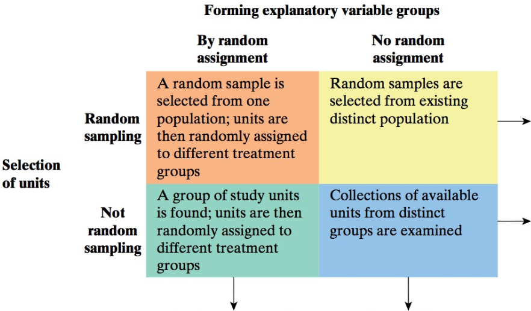

```{r setup, message=FALSE, echo=TRUE, include=FALSE, warning=FALSE}
knitr::opts_chunk$set(echo = TRUE)
```


# MA256 Lesson 8 - Causation - Can we say what caused the effect? (4.1-4.2)

### Review:  In last class, we saw this picture: 

{width="600"}

### Q1) What is the confidence level and significance level associated with each figure? 

\vfill

### Q2) Explain how we calculate the critical value for the 95\% Confidence (e.g. 1.960) using the R command `qnorm(0.975)` or `qt(0.975, n-1)`. 

```{r  eval=FALSE}
c(qnorm(0.975), qnorm(0.025))
c(qt(0.975, n-1), qt(0.025, n-1))
```
\vfill

### Q3) In LSN04 (\S 1.3-1.5) we saw the following guidelines for evaluating strength of evidence. Explain how these guidelines are related to the figures above. 

\begin{tabular}{c|p{4.0cm} | p{4.0cm}}
 & p-value  & standardized test-stat \\ \hline  
Weak Evidence against the null 
& $0.1 < p$   
& $|z| \le 1.5$    \\ 
Moderate Evidence against the null 
& $0.05 < p \le 0.1$ 
& $1.5 < |z| \le  2$    \\
Strong Evidence against the null 
& $0.01 < p \le  0.05$ 
& $2 < |z| \le 3$   \\
Very Strong Evidence against the null 
& $p \le 0.01 $ 
& $|z| > 3 $
\end{tabular}

\vfill 


### (Bonus - 2pts) Show how we can use the equation for the confidence interval to either "fail to reject" OR "reject" the null hypothesis, given (1) the t-statistic ($t=\frac{\bar{x} - \mu}{s/\sqrt{n}}$) and (2) a critical value ($t^*$) for a reasonable confidence level. 

\vspace{-0.1in} 

Hint: We will fail to reject the null hypothesis if $|t| < t^*$ and we  reject the null hypothesis if $|t| \ge t^*$


\newpage

## Causation 

### 1) What does it mean when two variables are *associated* (or *related*)?  What variables are associated in this picture? (see https://www.tylervigen.com/spurious-correlations for more)

{width="500"}

\vfill

### 2) What is an explanatory variable? What is a response variable? With the picture above, which is the explanatory/response variable? 

\vfill


### 3) What is a confounding variable? Can you think of any examples of confounding variables from the cheese and bedsheets example? 


\vfill

### 4) To help provide insight to when we can determine cause and effect or inference, fill in the following table. 

{width="400"}


\newpage


### 4) Does height provide an advantage for IOCT Completion Times? Run this code below in RStudio and discuss. Do you think there may be a confounding variable?  (change `eval=FALSE` to `eval=TRUE`)

```{r warning=FALSE, message=FALSE,  out.width = '40%', eval=TRUE}
library(tidyverse)

# IOCT_Data <- read_csv("IOCT_Data_Cleaned.csv") # un-comment if you don't have internet access
IOCT_Data <- read_csv("https://raw.githubusercontent.com/jkstarling/MA256/main/data/IOCT_Data_Cleaned.csv")
```

```{r warning=FALSE, message=FALSE,  out.width = '40%', eval=FALSE}
#Graph IOCT Data Height vs IOCT Time
IOCT_Data %>% 
  ggplot(aes(x = height, y=IOCT_Time))+
  geom_point() + #Scatter Plot when comparing two quantitative variables
  geom_smooth(method="lm")+ #Overlays the best-fitting line for the data 
  labs(x="All Heights", y="All IOCT Times")
```

\vfill


### 5) Run this code below in RStudio and discuss. What did we change compared with above?  What other variables may be confounding? (change `eval=FALSE` to `eval=TRUE`)

```{r warning=FALSE, message=FALSE,  out.width = '40%', eval=FALSE}
IOCT_Data %>%
  ggplot(aes(x = height, y=IOCT_Time, color=as.factor(sex)))+
  geom_point()+
  geom_smooth(method="lm")+
  labs(x="All Heights Colored by Sex", y="All IOCT Times Colored by Sex")
  
```

\vfill


### 6) "A Degree from West Point leads to higher earnings." Draw the causal diagram for this statement. What is the explanatory variable? What is the response variable? Can you think of any confounding variables  that may invluence your ability to get into West Point AND influence your ability to earn money? 


\vfill 

\newpage 


### 7) An undergrad Psychology student at Creighton University wants to investigate whether Netflix usage by U.S. college students results in a lower GPA. She intends to conduct a survey of her junior classmates, then connect their responses to whether their GPAs rose or fell at the end of the semester.

### a) Is this an observational study or experiment? Why?

\vfill


### b) What is the explanatory variable? Is it categorical or quantitative? What is the response variable? Is it categorical or quantitative?

\vfill


### c) Will a cause-and-effect conclusion be possible? Why or why not?

\vfill


### 8) Is random sampling or random assignment the more important consideration if the research question is whether a waiter generates higher tips by giving his name when he first greets customers?

\vfill


### 9) Is random sampling or random assignment the more important consideration if the research question is whether faculty at West Point tend to drive older cars than Firsties?

\vfill


### 10) In order to estimate the proportion of all voters who will likely vote for the incumbent in the city's upcoming mayoral race, a random sample of 500 likely voters is taken, finding that 320 say they will likely vote for the incumbent. The polling agency wishes to test whether there is evidence that more than 60 percent of likely voters will vote for the incumbent.

### a) Describe the parameter of interest in words.

\vfill


### b) State the null and alternate hypotheses using short-hand notation.

\vfill

\newpage 


### c) Is the theory-based approach appropriate? Why or why not?

\vfill

### d) Calculate the p-value using theory-based approach, determine the strength of evidence, and formulate a conclusion based on a 0.05 level of significance.

```{r}
# phat <- XXXX
# pi <- XXXX
# SD <- XXXX; SD
# zstat <- XXXX; zstat
# pval <- 1 - pnorm(zstat); pval
```

\vfill

### 11) Using the IOCT data file you read in above, answer the following questions. Assume that the APFT data was collected through a random selection method. Also assume that the histogram of the sit-up scores is a somewhat bell-shaped curve (Not strongly skewed). Create a 94\% confidence interval for the population average sit-up scores for all West Point cadets.


### a) Is the Theory-based Approach valid for this situation? Why or why not?

\vfill

### b) Use R to create the 94 percent Confidence Interval for the population average sit-up score for all West Point cadets.

```{r}
# alpha <- XXXX
# xbar <- mean(IOCT_Data$XXXX)
# SD <- sd(IOCT_Data$XXXX)
# n <- length(IOCT_Data$XXXX)
# multiplier <- qt(XXXX, XXXX)
# c(XXXX, XXXX)
```


\vfill

### c) Is it plausible that the average sit-up score for all West Point cadets is 85 at a 0.06 level of significance?


\vfill