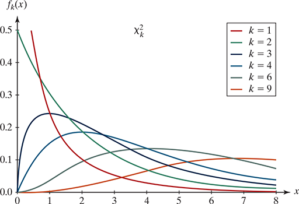
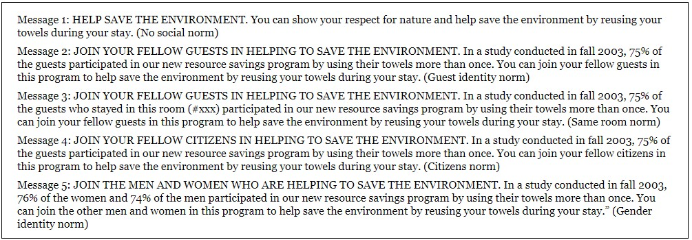

```{r setup, message=FALSE, echo=TRUE, include=FALSE, warning=FALSE}
knitr::opts_chunk$set(echo = TRUE)
```

\newcommand{\sol}[1]{\color{violet} #1 \color{black}}

<!-- \renewcommand{\sol}[1]{} -->


<!-- xcolor standard colors: 
black, blue, brown, cyan, darkgray, green, lime, magenta, olive, orange, red, purple, teal, violet, yellow, etc.  -->

# MA256 Lesson 13 - Multiple Proportions (8.1-8.3)


## Multiple-proportions: Similar to our methods used when considering two-proportions, but:

- \sol{additional columns compared to two-way tables}
- \sol{Segmented bar graphs have additional bars.}

### Hypothesis test:

$H_0:$ \sol{No association between the explanatory variable and the response variable. $\pi_1 = \pi_2 = \ldots = \pi_k$ for $k$ categories.}

$H_0:$ \sol{An association exists between the explanatory variable and the response variable. At least one proportion is different from the others. $\pi_i \ne \pi_j $ for $i, j \in \{1, \ldots, k\}$, for  $i\ne j$. }

Validity conditions: \sol{$\ge 10$ observations per cell}


### Chi-square (not "chai-squared" or "chee-squared"):

Binary response variable: 

\sol{$\chi^2 = \sum_i^{\# groups} \frac{(\hat p_i - \hat p)^2}{\hat p(1-\hat p) / n_1}$}


General (more than 2 categories for response variable):

\sol{$\chi^2 = \sum_i^{\# of cells} \frac{(observed - expected)^2}{expected}= \sum_i^{tot \# of cells} \frac{(O_i-E_i)^2}{E_i}$}

### Calculate the p-value for Chi-square distribution: 

\sol{dof: $k= (\# rows - 1) (\# columns -1) = (\# levels \;in\; resonse\; variable - 1) (\# levels\; in\; explanatory \;variable -1)$ \\
$1-pchisq(\chi^2, k)$}

\vfill

{width="350"}

\newpage

# Conserving Hotel Towels

## STEP 1. Ask a research question.
If you have stayed at a hotel recently, you may have noticed how guests are increasingly encouraged to practice conservation habits by not having their towels washed every day-instead hanging them back on the rack to be reused. Are some “encouragement strategies” more effective than others?


## STEP 2. Design a study and collect data.
A recent study (Goldstein et al., 2008) conducted a randomized experiment to investigate how different phrasings on signs placed on bathroom towel racks impacted guests’ towel reuse behavior. In particular, the researchers were interested in evaluating how messages that communicated different types of social norms impacted towel reuse. One week prior to a guest staying in the room, rooms at a particular hotel were randomly assigned to receive one of the following five messages on a sign hung on the towel bar in the room:

{width="500"}

Data were collected on 1,595 instances of potential towel reuse. For each of the 1,595 instances, room attendants recorded whether the hotel guest reused their towels.

### 1.  In your own words, state the research question of interest in this study.

\sol{Do different socially normed signs produce different rates of towel reuse?}


### 2. Identify the explanatory and response variables in this study, along with their types (categorical or quantitative). For the explanatory variable, indicate how many categories it involves if necessary.

Explanatory: \sol{message type, categorical with 5 categories}

Response: \sol{towel reuse, categorical with 2 categories}


### 3. Did the study design make use of any pairing of subjects or are the subjects who receive the different signs independent of each other?

\sol{Study design did not use pairing, the subjects who received different signs were independent of each other.}


### 4. State the appropriate null and alternative hypotheses for testing the researchers’ conjecture using both words and symbols.

$H_0:$ \sol{There is no association between type of message and towel reuse. $\pi_{none} = \pi_{guest} = \pi_{room} = \pi_{citizen} = \pi_{gender}$.}

$H_a:$ \sol{There is an association between message type and towel reuse. $\pi_i \ne \pi_j $ for $i, j \in \{none, guest, room, citizen, gender\}$, for  $i\ne j$. )}


## STEP 3. Explore the data.

### 5. Read in the `Towels.csv` file. Use the `count()`,  `pivot_wider()`, and `adorn_totals()` functions to create a table showing the numbers of instances of each message type and the reuse status. Also, create a stacked barchart showing the proportions of each message type. 

```{r message= FALSE, error=FALSE, out.width = '40%'}
library(tidyverse)
library(janitor)
towels <- read_csv("https://raw.githubusercontent.com/jkstarling/MA256/main/data/Towels.csv")

towel.tab <- towels %>% 
  tabyl(Use_case, Message) %>%
  adorn_totals(c("row", "col"))
towel.tab

# Plot
towels %>% ggplot(aes(x=Message, fill= Use_case)) + 
  geom_bar(position= position_fill())
```


## STEP 4. Draw Inferences beyond the data.


### Chi-square statistic


### 6. Do we meet the validity conditions for a chi-squared test with these data? Justify your answer. 

\sol{Yes. All ten cells have counts of at least 10, so validity conditions are met.}


### 7. Calculate the $\chi^2$ statistic using the general form of the chi-square statistic (e.g. the `Observed` and `Expected` method).

```{r}
towel.tab
```


```{r}
phat <- 909 / 1595
observed <- c(189, 183, 190, 192, 155, 145, 127, 150, 113, 151)
tot <- c(334, 310, 340, 305, 306)
expected <- c(rep(phat,5) * tot, rep(1-phat, 5) * tot)

mychisq <- sum( (observed - expected)^2 / expected)
mychisq
```


### 8. Calculate the p-value for your estimated chi-squared value. (See course guide for Lesson 14). Evaluate the strength of evidence provided by the data against the null hypothesis. Summarize your conclusion in the context of this study.

```{r}
num.rows <- 2
num.cols <- 5
k <- (num.rows - 1) * (num.cols - 1)
pval <- 1 - pchisq(mychisq, k)
pval
```

\sol{With a p-value of 0.038, we have strong evidence against the null hypothesis that there is no association between the type of message and towell use. We can say that at least one of the messages had an association with message and towell use. }


```{r}
chisq.test(data.frame(towel.tab[1:2, 2:6]))
```


## STEP 5: Summarize conculsions. 

### 9. Is this an observational study or a randomized experiment?

\sol{Randomized experiment, causal conclusions can be made.}

### 10. Explain how the conclusions of this study are limited by conducting the study at a single hotel.

\sol{Generalization is limited because not all hotels attract the same clientele (rural, urban, resort, business).}

## STEP 6. Look back and ahead.

### 11. Summarize your conclusion for your analysis of the data from this study. Include a recommendation for the hotel manager about whether it matters what message is used, which message should be used, and how large of an impact the best message would be expected to have. Think about the study and its design. Were there any limitations you feel need to be addressed? Did the design match the research question? Can you suggest a better sampling method of hotel guests-a better way to collect data on towel use? Share some ideas for a logical next study.


\sol{Researchers wondered whether different socially normed messages led to different rates of towel reuse in hotels. Rooms were randomly assigned to have one of 5 socially-normed signs hung on the towel bar. Data were collected on 1595 instances of potential towel reuse. It was hypothesized that there would be an association between type of message and towel reuse. Data gathered showed 37.0\% towel reuse in the no normed sign group, 44.1\% reuse in the guest-normed group, 49.3\% in the room-normed group, 43.4\% in the citizen-normed group, and 41.0\% in the gender-normed group. A p-value of 0.0380 provided strong evidence against the null and in support of the alternative that there is an association between message type and towel reuse. The study should be repeated in a number of different hotels to see whether similar results are obtained.}


# Nearsightedness and NightLights REDUX

Recall Example 4.1, which described a study investigating whether there is a relationship between use of night lights in a child’s room before age 2 and the child’s eyesight condition a few years later. In Chapter 4, we presented a two-way table of counts from the study examining whether the child was nearsighted as the response variable:


|                 | Darkness | Night light | Room light |
|-----------------|----------|-------------|------------|
| Nearsighted     | 18       | 78          | 41         |
| Not nearsighted | 154      | 154         | 34         |
| Total           | 172      | 232         | 75         |

The conditional proportions of nearsightedness in the three lighting groups are 0.105, 0.336, and 0.547, respectively, which suggest that the more light used in the child’s room, the more likely the child is to become nearsighted. Now we know how to calculate a standardized statistic and estimate a p-value to measure the strength of evidence provided by these sample data for the conjecture that eyesight is associated with the type of lighting used in the child’s room.

### 1. State null and alternative hypotheses in terms of population proportions.

\sol{Null: The population proportion of near-sightedness is the same in each of the three groups \\
Alternative: At least one of the population proportions is different}

### 2. State null and alternative hypotheses in terms of association between variables.

\sol{Null: There is no association between being near sighted and use of night lights \\
Alternative: There is an association between being near sighted and use of night lights}

### 3. Are the validity conditions necessary for a chi-square test met for these data? Explain.

\sol{Yes, there are at least 10 observations in each of the 6 cells of the 2-way table.}

### 4. To find out how many children we expect to be in the (darkness, nearsighted) cell of the table, answer (a)–(d):

a) Find the overall proportion of children who were nearsighted in the sample.
```{r}
p.near <- (18+78+41)/(172+232+75)
p.near
```

b) How many children in the sample slept in darkness?
```{r}
slept.in.darkness <- 172
slept.in.darkness
```

c) Multiply these two numbers together to find the “expected” number of children who would be nearsighted in the “slept in darkness” group if the null hypothesis were true (the probability of nearsightedness is the same in each condition).
```{r}
p.near * slept.in.darkness
```

d) How different is this expected cell count from what was observed for that cell? What does this suggest about the strength of evidence against the null hypothesis?

\sol{49.2 vs. 18, these counts are quite a bit different suggesting some evidence against the null hypothesis, because a lot fewer children were near-sighted in this group than we would expect if the null hypothesis was true.}


### 5.  Calculate the $\chi^2$ statistic using the `Observed` and `Expected` method. What is the associate p-value?
```{r warning=FALSE, message=FALSE,  out.width = '40%'}
tot2 <- c(172, 232, 75)
phat2 <- (18 + 78 + 41) / sum(tot2)
observed2 <- c(18, 78, 41, 154, 154, 34)

expected2 <- c(rep(phat2,3) * tot2, rep(1-phat2, 3) * tot2)

mychisq2 <- sum( (observed2 - expected2)^2 / expected2)
mychisq2
 
k2 <- (3-1) * (2-1)
1-pchisq(mychisq2, k2)

```
\sol{Chi-square = 55.52, p-value < 0.0001. We have strong evidence of an association between room darkness and near-sightedness in children.}


### 6. The original research study actually classified the response variable into three categories of eyesight, as shown in the following table. 

|                   | Darkness | Night light | Room light |
|-------------------|----------|-------------|------------|
| Nearsighted       | 18       | 78          | 41         |
| Normal refraction | 114      | 115         | 22         |
| Farsighted        | 40       | 39          | 12         |

Create a segmented bar graph to summarize this table. Discuss what the graph reveals, including what this graph tells you that we did not learn from the initial table showing only nearsighted vs. not nearsighted.

```{r warning=FALSE, message=FALSE,  out.width = '40%', eval=TRUE}
nv2 <- data.frame(vision = c(rep("near", 3), rep("normal", 3), rep("far", 3)),
                  light = c("dark", "nlight", "rlight", "dark", "nlight", "rlight", "dark", "nlight", "rlight"),
                  counts = c(18,78,41,114,115,22,40,39,12) )

nv2 %>% ggplot(aes(x = light, y = counts, fill = factor(vision))) + geom_bar(position="fill", stat="identity")
```
\sol{There are a lot fewer near-sighted children than expected in the dark room group, and a lot more than expected in the room light group.}

###  7. With this new table, do you need to change your null and alternative hypotheses from \#2?

\sol{No, the no association/association way to state hypotheses still works.}

### 8. Are the validity conditions for the chi-square test met for this table?

\sol{Yes, there are at least 10 individuals in each cell of the table.}

### 9. Calculate the $\chi^2$ statistic and p-value. Intepret your answer in context of the problem.  

```{r}
tot3 <- c(172, 232, 75)
phat.d <- (18 + 78 + 41) / sum(tot3)
phat.n <- (114 + 115 + 22) / sum(tot3)
phat.r <- (40 + 39 + 12) / sum(tot3)
observed3 <- c(18, 78, 41, 114, 115, 22, 40, 39, 12)

expected3 <- c(rep(phat.d,3) * tot3, rep(phat.n, 3) * tot3, rep(phat.r, 3) * tot3)

mychisq3 <- sum( (observed3 - expected3)^2 / expected3)
mychisq3
 
k3 <- (3-1) * (3-1)
1-pchisq(mychisq2, k3)
```

### 10. Does this study suggest that use of night lights and room lights causes an increase to the chance that a child is nearsighted? Why or why not?

\sol{No, random assignment was not used, so a cause-and-effect conclusion cannot be drawn. One possible confounding variable here is parental eyesight. Near-sighted parents are more likely to use lights in the room, and, due to genetics, near-sighted parents are more likely to have near-sighted children.}
