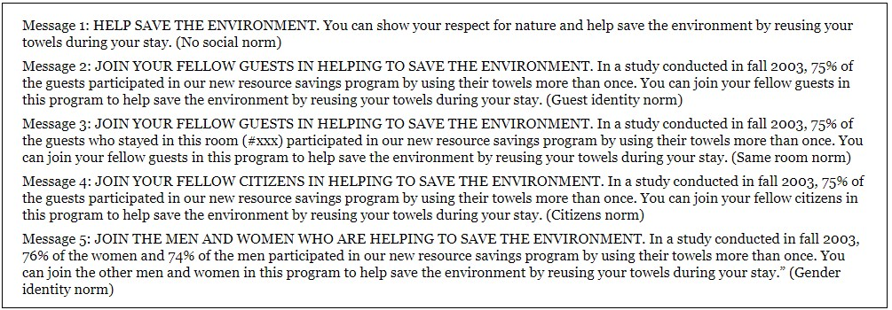

```{r setup, message=FALSE, echo=TRUE, include=FALSE, warning=FALSE}
knitr::opts_chunk$set(echo = TRUE)
```

\newcommand{\sol}[1]{\color{violet} #1 \color{black}}

<!-- \renewcommand{\sol}[1]{} -->


<!-- xcolor standard colors: 
black, blue, brown, cyan, darkgray, green, lime, magenta, olive, orange, red, purple, teal, violet, yellow, etc.  -->

# MA256 Lesson 14 - Multiple Proportions (8.1-8.3)


## Review: Comparing two proportions.

### Hypotheses (in symbols):

$H_0:$ \sol{$\pi_{1} - \pi_{2} = 0 $}

$H_a:$ \sol{$\pi_{1} - \pi_{2} \ne 0$}

Strength of Evidence:  \sol{Calculate z statistic: $z=\frac{\hat p_{1} - \hat p_{2}}{\sqrt{\pi (1-\pi) \left(\frac{1}{n_1}+\frac{1}{n_2}\right)}}$, where $\hat p$ is the total proportion of successes}

Confidence Interval:  \sol{$\hat p_2 - \hat p_1 \pm z^*_{(1-\alpha/2)} \times \sqrt{(\hat p_1 ( 1-\hat p_1)/ n_1) + (\hat p_2 ( 1-\hat p_2)/ n_2)}$}

Validity conditions: \sol{Must have at least 10 observations in each category of the response variable ($\ge 10$ for each cell in a two-way table)}


## Multiple-proportions: Similar to our methods used when considering two-proportions, but:

- \sol{additional columns compared to two-way tables}
- \sol{Segmented bar graphs have additional bars.}

### Hypothesis test:

$H_0:$ \sol{No association between the explanatory variable and the response variable. $\pi_1 = \pi_2 = \ldots = \pi_k$ for $k$ categories.}

$H_0:$ \sol{An association exists between the explanatory variable and the response variable. At least one proportion is different from the others. $\pi_i \ne \pi_j $ for $i, j \in \{1, \ldots, k\}$, for  $i\ne j$. }

Validity conditions: \sol{$\ge 10$ observations per cell}


### Chi-square (not "chai-squared"):

Binary response variable: 

\sol{$\chi^2 = \sum \frac{(\hat p_i - \hat p)^2}{\hat p(1-\hat p) / n_1}$}


General (more than 2 categories for response variable):

\sol{$\chi^2 = \sum_i^{tot \# of cells} \frac{(observed - expected)^2}{expected}= \sum_i^{tot \# of cells} \frac{(O_i-E_i)^2}{E_i}$}

### Calculate the p-value for Chi-square distribution: 

\sol{dof: $k= (\# rows - 1) (\# columns -1) = (\# levels \;in\; resonse\; variable - 1) (\# levels\; in\; explanatory \;variable -1)$ \\
$1-pchisq(\chi^2, k)$}


\newpage

# Conserving Hotel Towels

## STEP 1. Ask a research question.
If you have stayed at a hotel recently, you may have noticed how guests are increasingly encouraged to practice conservation habits by not having their towels washed every day-instead hanging them back on the rack to be reused. Are some “encouragement strategies” more effective than others?


## STEP 2. Design a study and collect data.
A recent study (Goldstein et al., 2008) conducted a randomized experiment to investigate how different phrasings on signs placed on bathroom towel racks impacted guests’ towel reuse behavior. In particular, the researchers were interested in evaluating how messages that communicated different types of social norms impacted towel reuse. One week prior to a guest staying in the room, rooms at a particular hotel were randomly assigned to receive one of the following five messages on a sign hung on the towel bar in the room:

{width="500"}

Data were collected on 1,595 instances of potential towel reuse. For each of the 1,595 instances, room attendants recorded whether the hotel guest reused their towels.

### 1.  In your own words, state the research question of interest in this study.

\sol{Do different socially normed signs produce different rates of towel reuse?}


### 2. Identify the explanatory and response variables in this study, along with their types (categorical or quantitative). For the explanatory variable, indicate how many categories it involves if necessary.

Explanatory: \sol{message type, categorical with 5 categories}

Response: \sol{towel reuse, categorical with 2 categories}


### 3. Did the study design make use of any pairing of subjects or are the subjects who receive the different signs independent of each other?

\sol{Study design did not use pairing, the subjects who received different signs were independent of each other.}


### 4. State the appropriate null and alternative hypotheses for testing the researchers’ conjecture using both words and symbols.

$H_0:$ \sol{There is no association between type of message and towel reuse. $\pi_{none} = \pi_{guest} = \pi_{room} = \pi_{citizen} = \pi_{gender}$.}

$H_a:$ \sol{There is an association between message type and towel reuse. $\pi_i \ne \pi_j $ for $i, j \in \{none, guest, room, citizen, gender\}$, for  $i\ne j$. )}


## STEP 3. Explore the data.

### 5. Read in the `Towels.csv` file. Use the `count()`,  `pivot_wider()`, and `adorn_totals()` functions to create a table showing the numbers of instances of each message type and the reuse status. Also, create a stacked barchart showing the proportions of each message type. 

```{r message= FALSE, error=FALSE, out.width = '40%'}
library(tidyverse)
library(janitor)
towels <- read_csv("https://raw.githubusercontent.com/jkstarling/MA256/main/data/Towels.csv")

towel.tab <- towels %>%
  count(Message,Use_case) %>%
  pivot_wider(names_from = Message, values_from = n) %>%
  adorn_totals(c("row", "col"))
towel.tab
# Plot
towels %>% ggplot(aes(x=Message, fill= Use_case)) + 
  geom_bar(position= position_fill())
```


## STEP 4. Draw Inferences beyond the data.

### 6. Apply the 3S strategy: 

1) Statistic: Report and use the mean group difference for this study.  (see $\S 8.1, p. 463$)
```{r}
p.c <-  145 / 334
p.ge <- 127 / 310
p.gu <- 150 / 340
p.n <-  113 / 305
p.r <-  151 / 306

# make vector with the absolute value of the differences
gdiffs <- c(abs(p.c - p.ge), abs(p.c - p.gu), abs(p.c - p.n), abs(p.c - p.r),
            abs(p.ge - p.gu), abs(p.ge - p.n), abs(p.ge - p.r),
            abs(p.gu - p.n), abs(p.gu - p.r),
            abs(p.n - p.r))
# calculate the mean of the absolute value of the diffs
mean(gdiffs)

# OR 
reuse <- towel.tab[2,2:6]
tot <- towel.tab[3,2:6]
p.all <- unlist(unname(reuse/tot))

mysum <- c()
for (ii in 1:4){
  i= ii + 1
  mysum <- append(mysum, abs(p.all[ii] - p.all[i:5]))
}
mean(mysum)
```

2) Simulate: How would you simulate the towel use under the null hypothesis? Conduct 1000 replications and report a p-value. 

```{r warning=FALSE, message=FALSE,  out.width = '40%', eval=TRUE}
# define function to calculate mean group differences
get.mean.group.diffs <- function(m.vec, u.vec){
  mtab <- table(u.vec, m.vec)
  p.all <- mtab['reuse',] / colSums(mtab)
  mysum <- c()
  for (ii in 1:4){
    i= ii + 1
    mysum <- append(mysum, abs(p.all[ii] - p.all[i:5]))
    }
  mean(mysum)
  }

set.seed(256)

M <- 1000
gdif.mean <- 0.0554887

# duplicate vectors
mess <- towels$Message
usecase <- towels$Use_case

# create df to record values
RES <- data.frame(res = rep(NA, M))

for(rep in 1:M){
  use.shuf <- sample(usecase)
  RES$res[rep] <- get.mean.group.diffs(mess, use.shuf)
}

# plot results
RES %>% ggplot(aes(x=res)) +
  geom_histogram() +
  geom_vline(xintercept = gdif.mean, color="red")

# estimate p-value
sum(RES$res >= gdif.mean) / M
```

3) Strength of evidence: Based on the p-value, evaluate the strength of evidence provided by the data against the null hypothesis. Summarize your conclusion in the context of this study.

\sol{With a p-value of 0.027, we find strong evidence against the null and in favor of the alternative that at least one type of message results in a probability of towel reuse that is different from the others.}


### Another statistic: Chi-square statistic

### 7. Determine the overall proportion, $\hat p$, of rooms that reused towels.
```{r}
phat <- 686 / 1595
phat
```


### 8. We will calculate the standard error of a group proportion by computing $\sqrt{\hat p (1-\hat p)/n_i}$ where  is the overall proportion found in \#7 and $n_i$ is the sample size for the $i$th group. Find the standard error of the group proportion for each of the five groups.
```{r}
n.c <-  334
n.ge <- 310
n.gu <- 340
n.n <-  305
n.r <-  306

se.c <- sqrt(phat * (1-phat) / n.c)
se.ge <- sqrt(phat * (1-phat) / n.ge)
se.gu <- sqrt(phat * (1-phat) / n.gu)
se.n <- sqrt(phat * (1-phat) / n.n)
se.r <- sqrt(phat * (1-phat) / n.r)

# OR
se.vec <- sqrt(phat * (1-phat) / tot)
```


### 9. Create a standardized z-statistic for each conditional proportion compared to this overall proportion. To do this take each of the five group proportions, subtract the overall proportion (\#7), and then divide the result by the standard deviation you found for that group in \#8.

```{r}
phat <- 686 / 1595
zs <- c((p.c - phat) / se.c,
        (p.ge - phat) / se.ge,
        (p.gu - phat) / se.gu,
        (p.n - phat) / se.n,
        (p.r - phat) / se.r)
zs
# OR
zs <- (c(p.c, p.ge, p.gu, p.n, p.r) - phat) / c(se.c, se.ge, se.gu, se.n, se.r)
# OR 
zs <- unlist((p.all - phat) / se.vec)
```


### 10. Which of the five standardized statistics are larger than 2 or smaller than -2, suggesting strong evidence that the group proportion is significantly different than the overall proportion?

\sol{None and Same Room}


### 11. Square each of these values and sum them to calculate the chi-square statistic.

```{r}
chsq <- sum(zs^2)
chsq
```


### 12. What kinds of values (large, small, positive, negative) will the chi-square statistic have if the null hypothesis is true? What kinds of values will provide evidence against the null hypothesis?

\sol{Small/non-negative if null is true, Large/non-negative if alternative is true.}


### 13. Calculate the p-value. 

```{r}
k <- (2-1)*(5-1)
1 - pchisq(chsq, k)
```

### 14. How does the p-value based on the $\chi^2$ statistic compare to the one based on the Mean Group Diff statistic? Are they similar? Is your conclusion about strength of evidence provided by the data against the null hypothesis similar?

\sol{The p-values are similar. The conclusions regarding strength of evidence against the null are the same.}


### 15. Do we meet the validity conditions for a chi-squared test with these data? Justify your answer. 

\sol{Yes. All ten cells have counts of at least 10, so validity conditions are met.}


### 16. Calculate the $\chi^2$ statistic using the general form of the chi-square statistic (e.g. the `Observed` and `Expected` method).

```{r}
towel.tab
p.not <- 909 / 1595
p.reuse <- 686 / 1595
observed.data <- data.frame(towel.tab[1:2, 2:6])
observed.data
expected.data <- observed.data
expected.data[1,1] <- n.c * p.not
expected.data[1,2] <- n.ge * p.not
expected.data[1,3] <- n.gu * p.not
expected.data[1,4] <- n.n * p.not
expected.data[1,5] <- n.r * p.not
expected.data[2,1] <- n.c * p.reuse
expected.data[2,2] <- n.ge * p.reuse
expected.data[2,3] <- n.gu * p.reuse
expected.data[2,4] <- n.n * p.reuse
expected.data[2,5] <- n.r * p.reuse
expected.data

mychisq <- sum((observed.data - expected.data)^2 / expected.data)

# OR 
chisq.test(observed.data)
```


### 17. Calculate the 95% CI(s) for difference in proportions. a) How many intervals are produced? b) Which conditions are significantly different from each other? How are you deciding? c)For one of the intervals you identified in part (b), write a one-sentence interpretation of the interval, being very clear what is supposed to be captured inside the interval and which condition has a more positive effect on towel use and by how much.

\sol{a) There are 10 intervals.}
```{r}
ci.2props <- function(p1, p2, n1, n2){
  se <- sqrt((p1*(1-p1)/n1) + (p2*(1-p2)/n2))
  diff <- p1 - p2
  c(diff - 2 * se, diff + 2 * se)
}

ci.2props(p.c, p.ge, n.c, n.ge)
ci.2props(p.c, p.gu, n.c, n.gu)
ci.2props(p.c, p.n, n.c, n.n)
ci.2props(p.c, p.r, n.c, n.r)
ci.2props(p.ge, p.gu, n.ge, n.gu)
ci.2props(p.ge, p.n, n.ge, n.n)
ci.2props(p.ge, p.r, n.ge, n.r)  #***
ci.2props(p.gu, p.n, n.gu, n.n)
ci.2props(p.gu, p.r, n.gu, n.r)
ci.2props(p.n, p.r, n.n, n.r)  #***
```

\sol{b) none vs sameroom and sameroom vs gender show significant differences in the proportion who reuse towels. The decision is based on whether zero is in the interval. If zero is in the interval for the difference in proportion of re-users, then it is plausible the population proportions are the same.\\
c. The population proportion of guests who reuse their towel from rooms with the sameroom social norm on the sign is 0.045 to 0.201 higher than the population proportion of guests who reuse their towels in rooms with no social norm on the sign.}


## STEP 5: Summarize conculsions. 

### 17. Is this an observational study or a randomized experiment?

\sol{Randomized experiment, causal conclusions can be made.}

### 18. Explain how the conclusions of this study are limited by conducting the study at a single hotel.

\sol{Generalization is limited because not all hotels attract the same clientele (rural, urban, resort, business).}

## STEP 6. Look back and ahead.

### 19. Summarize your conclusion for your analysis of the data from this study. Include a recommendation for the hotel manager about whether it matters what message is used, which message should be used, and how large of an impact the best message would be expected to have. Think about the study and its design. Were there any limitations you feel need to be addressed? Did the design match the research question? Can you suggest a better sampling method of hotel guests-a better way to collect data on towel use? Share some ideas for a logical next study.


\sol{Researchers wondered whether different socially normed messages led to different rates of towel reuse in hotels. Rooms were randomly assigned to have one of 5 socially-normed signs hung on the towel bar. Data were collected on 1595 instances of potential towel reuse. It was hypothesized that there would be an association between type of message and towel reuse. Data gathered showed 37.0\% towel reuse in the no normed sign group, 44.1\% reuse in the guest-normed group, 49.3\% in the room-normed group, 43.4\% in the citizen-normed group, and 41.0\% in the gender-normed group. A p-value of 0.0380 provided strong evidence against the null and in support of the alternative that there is an association between message type and towel reuse. Follow-up analysis comparing pairs of proportions found that a significantly higher proportion of those in the room-normed group reused their towels than those in the no social norm group. Also a significantly higher proportion of those in the room-normed group reused their towels than those in the gender-normed group. I would recommend to the hotel manager that they use the room-normed message to promote towel reuse in their hotel. Over the no-socially normed message, this would increase their towel reuse by 4.5 to 20.1 percentage points. The study should be repeated in a number of different hotels to see whether similar results are obtained.}


## Nearsightedness and NighLights REDUX

Recall Example 4.1, which described a study investigating whether there is a relationship between use of night lights in a child’s room before age 2 and the child’s eyesight condition a few years later. In Chapter 4, we presented a two-way table of counts from the study examining whether the child was nearsighted as the response variable:


\begin{tabular}{ |c|c|c|c| } 
 \hline
 & Darkness & Night light & Room light \\ 
Nearsighted & 18 & 78 & 41 \\
Not nearsighted & 154 & 154 & 34 \\
Total & 172 & 232 & 75 \\  \hline
\end{tabular}

The conditional proportions of nearsightedness in the three lighting groups are 0.105, 0.336, and 0.547, respectively, which suggest that the more light used in the child’s room, the more likely the child is to become nearsighted. Now we know how to calculate a standardized statistic and estimate a p-value to measure the strength of evidence provided by these sample data for the conjecture that eyesight is associated with the type of lighting used in the child’s room.

### 1. State null and alternative hypotheses in terms of population proportions.

\sol{Null: The population proportion of near-sightedness is the same in each of the three groups \\
Alternative: At least one of the population proportions is different}

### 2. State null and alternative hypotheses in terms of association between variables.

\sol{Null: There is no association between being near sighted and use of night lights \\
Alternative: There is an association between being near sighted and use of night lights}

### 3. Are the validity conditions necessary for a chi-square test met for these data? Explain.

\sol{Yes, there are at least 10 observations in each of the 6 cells of the 2-way table.}

### 4. To find out how many children we expect to be in the (darkness, nearsighted) cell of the table, answer (a)–(d):

a) Find the overall proportion of children who were nearsighted in the sample.
```{r}
p.near <- (18+78+41)/(172+232+75)
```

b) How many children in the sample slept in darkness?
```{r}
slept.in.darkness <- 172
```

c) Multiply these two numbers together to find the “expected” number of children who would be nearsighted in the “slept in darkness” group if the null hypothesis were true (the probability of nearsightedness is the same in each condition).
```{r}
p.near * slept.in.darkness
```


d) How different is this expected cell count from what was observed for that cell? What does this suggest about the strength of evidence against the null hypothesis?

\sol{49.2 vs. 18, these counts are quite a bit different suggesting some evidence against the null hypothesis, because a lot fewer children were near-sighted in this group than we would expect if the null hypothesis was true.}


### 5. A similar calculation is performed to find the expected cell count for each of the six cells of the table. The chi-square statistic is obtained by squaring the differences in the observed and expected counts, dividing by the expected count (a form of standardizing), and then summing the six values. This can be thought of as (O - E)2/E, where O = observed count and E = expected count. Calculate the $\chi^2$ statistic using this method. 
```{r warning=FALSE, message=FALSE,  out.width = '40%'}
nv1 <- data.frame(vision = c(rep("near", 3), rep("notnear", 3)),
                  light = c("dark", "nlight", "rlight", "dark", "nlight", "rlight"),
                  count = c(18,78,41,154,154,35))
# nv1 %>% ggplot(aes(x=Message, fill= Use_case)) + 
#   geom_bar(position= position_fill())
```


### 6. The original research study actually classified the response variable into three categories of eyesight, as shown in the following table:

\begin{tabular}{ |c|c|c|c| } 
 \hline
 & Darkness & Night light & Room light \\ 
Nearsighted & 114 & 115 & 22 \\
Farsighted & 40 & 39 & 12 \\  \hline
\end{tabular}


### 7. Create a segmented bar graph to summarize this table. Discuss what the graph reveals, including what this graph tells you that we did not learn from the initial table showing only nearsighted vs. not nearsighted.
```{r warning=FALSE, message=FALSE,  out.width = '40%', eval=TRUE}
nv2 <- data.frame(vision = c(rep("near", 3), rep("normal", 3), rep("far", 3)),
                  light = c("dark", "nlight", "rlight", "dark", "nlight", "rlight", "dark", "nlight", "rlight"),
                  counts = c(18,78,41,114,115,22,40,39,12) )

nv2 %>% ggplot(aes(x = light, y = counts, fill = factor(vision))) + geom_bar(position="fill", stat="identity")
```


###  8. With this new table, do you need to change your null and alternative hypotheses from \#2?

\sol{No, the no association/association way to state hypotheses still works.}

### 9. Are the validity conditions for the chi-square test met for this table?

\sol{Yes, there are at least 10 individuals in each cell of the table.}

### 10. Calculate the $\chi^2$ statistic. Hint: See p.482 for help. 


