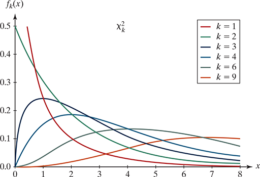

```{r setup, message=FALSE, echo=TRUE, include=FALSE, warning=FALSE}
knitr::opts_chunk$set(echo = TRUE)
```


# MA256 Lesson 14 - Multiple Proportions (8.1-8.3)


## Multiple-proportions: Similar to our methods used when considering two-proportions, but:

\vfill

### Hypothesis test:

$H_0:$ 

$H_0:$  

Validity conditions:  


### Chi-square (not "chai-squared" or "chee-squared"):

Binary response variable: 

\vfill

General (more than 2 categories for response variable):

\vfill
### Calculate the p-value for Chi-square distribution: 


\vfill

{width="350"}

\newpage

# Conserving Hotel Towels

## STEP 1. Ask a research question.
If you have stayed at a hotel recently, you may have noticed how guests are increasingly encouraged to practice conservation habits by not having their towels washed every day-instead hanging them back on the rack to be reused. Are some “encouragement strategies” more effective than others?


## STEP 2. Design a study and collect data.
A recent study (Goldstein et al., 2008) conducted a randomized experiment to investigate how different phrasings on signs placed on bathroom towel racks impacted guests’ towel reuse behavior. In particular, the researchers were interested in evaluating how messages that communicated different types of social norms impacted towel reuse. One week prior to a guest staying in the room, rooms at a particular hotel were randomly assigned to receive one of the following five messages on a sign hung on the towel bar in the room:

{width="500"}

Data were collected on 1,595 instances of potential towel reuse. For each of the 1,595 instances, room attendants recorded whether the hotel guest reused their towels.

### 1.  In your own words, state the research question of interest in this study.

\vfill

### 2. Identify the explanatory and response variables in this study, along with their types (categorical or quantitative). For the explanatory variable, indicate how many categories it involves if necessary.

Explanatory:  

\vspace{0.2cm}
Response:  

\vspace{0.2cm}

### 3. Did the study design make use of any pairing of subjects or are the subjects who receive the different signs independent of each other?

\vfill

### 4. State the appropriate null and alternative hypotheses for testing the researchers’ conjecture using both words and symbols.

$H_0:$  
\vspace{0.2cm}

$H_a:$  
\vspace{0.2cm}


## STEP 3. Explore the data.

### 5. Read in the `Towels.csv` file. Use the `count()`,  `pivot_wider()`, and `adorn_totals()` functions to create a table showing the numbers of instances of each message type and the reuse status. Also, create a stacked barchart showing the proportions of each message type. 

```{r message= FALSE, error=FALSE, out.width = '40%'}
# library(tidyverse)
# library(janitor)
# towels <- read_csv("https://raw.githubusercontent.com/jkstarling/MA256/main/data/Towels.csv")
# 
# towel.tab <- towels %>% 
#   tabyl(XXXXXX, XXXXXX) %>%
#   adorn_totals(c("row", "col"))
# towel.tab
# 
# # Plot
# towels %>% ggplot(aes(x=XXXXXX, fill= XXXXXX)) + 
#   geom_XXXXXX
```


## STEP 4. Draw Inferences beyond the data.


### Chi-square statistic


### 6. Do we meet the validity conditions for a chi-squared test with these data? Justify your answer. 

\vfill


### 7. Calculate the $\chi^2$ statistic using the general form of the chi-square statistic (e.g. the `Observed` and `Expected` method).

```{r}
# towel.tab
```


```{r}
# phat <- XXXXXX
# observed <- c(XXXXXX)
# tot <- c(XXXXXX)
# expected <- c(XXXXXX, XXXXXX)
# 
# mychisq <- XXXXXX
# mychisq
```


### 8. Calculate the p-value for your estimated chi-squared value. (See course guide for Lesson 14). Evaluate the strength of evidence provided by the data against the null hypothesis. Summarize your conclusion in the context of this study.

```{r}
# num.rows <- XXXXXX
# num.cols <- XXXXXX
# k <- XXXXXX
# pval <- XXXXXX
# pval
```

\vfill


```{r}
# chisq.test(XXXXXX)
```


## STEP 5: Summarize conculsions. 

### 9. Is this an observational study or a randomized experiment?

\vfill

### 10. Explain how the conclusions of this study are limited by conducting the study at a single hotel.

\vfill

## STEP 6. Look back and ahead.

### 11. Summarize your conclusion for your analysis of the data from this study. Include a recommendation for the hotel manager about whether it matters what message is used, which message should be used, and how large of an impact the best message would be expected to have. Think about the study and its design. Were there any limitations you feel need to be addressed? Did the design match the research question? Can you suggest a better sampling method of hotel guests-a better way to collect data on towel use? Share some ideas for a logical next study.


\vfill

 


# Nearsightedness and NighLights REDUX

Recall Example 4.1, which described a study investigating whether there is a relationship between use of night lights in a child’s room before age 2 and the child’s eyesight condition a few years later. In Chapter 4, we presented a two-way table of counts from the study examining whether the child was nearsighted as the response variable:


|                 | Darkness | Night light | Room light |
|-----------------|----------|-------------|------------|
| Nearsighted     | 18       | 78          | 41         |
| Not nearsighted | 154      | 154         | 34         |
| Total           | 172      | 232         | 75         |

The conditional proportions of nearsightedness in the three lighting groups are 0.105, 0.336, and 0.547, respectively, which suggest that the more light used in the child’s room, the more likely the child is to become nearsighted. Now we know how to calculate a standardized statistic and estimate a p-value to measure the strength of evidence provided by these sample data for the conjecture that eyesight is associated with the type of lighting used in the child’s room.

\newpage

### 1. State null and alternative hypotheses in terms of population proportions.

\vfill


### 2. State null and alternative hypotheses in terms of association between variables.

\vfill


### 3. Are the validity conditions necessary for a chi-square test met for these data? Explain.

\vfill

### 4. To find out how many children we expect to be in the (darkness, nearsighted) cell of the table, answer (a)–(d):

a) Find the overall proportion of children who were nearsighted in the sample.
```{r}
# p.near <- XXXXXX
# p.near
```

b) How many children in the sample slept in darkness?
```{r}
# slept.in.darkness <- XXXXXX
# slept.in.darkness
```

c) Multiply these two numbers together to find the “expected” number of children who would be nearsighted in the “slept in darkness” group if the null hypothesis were true (the probability of nearsightedness is the same in each condition).
```{r}
# XXXXXX
```

d) How different is this expected cell count from what was observed for that cell? What does this suggest about the strength of evidence against the null hypothesis?

\vfill


### 5.  Calculate the $\chi^2$ statistic using the `Observed` and `Expected` method. What is the associate p-value?
```{r warning=FALSE, message=FALSE,  out.width = '40%'}
# tot2 <- XXXXXX
# phat2 <- XXXXXX
# observed2 <- XXXXXX
# 
# expected2 <- c(XXXXXX, XXXXXX)
# 
# mychisq2 <- XXXXXX
# mychisq2
#  
# k2 <- XXXXXX
# 1-pchisq(XXXXXX)

```

\newpage

### 6. The original research study actually classified the response variable into three categories of eyesight, as shown in the following table. 

|                   | Darkness | Night light | Room light |
|-------------------|----------|-------------|------------|
| Nearsighted       | 18       | 78          | 41         |
| Normal refraction | 114      | 115         | 22         |
| Farsighted        | 40       | 39          | 12         |

Create a segmented bar graph to summarize this table. Discuss what the graph reveals, including what this graph tells you that we did not learn from the initial table showing only nearsighted vs. not nearsighted.

```{r warning=FALSE, message=FALSE,  out.width = '40%', eval=TRUE}
# nv2 <- data.frame(vision = c(rep("near", 3), rep("normal", 3), rep("far", 3)),
#                   light = c("dark", "nlight", "rlight", "dark", "nlight", "rlight", "dark", "nlight", "rlight"),
#                   counts = c(XXXXXX) )
# 
# nv2 %>% ggplot(aes(x = XXXXXX, y = XXXXXX, fill = XXXXXX)) + XXXXXX
```
 
###  7. With this new table, do you need to change your null and alternative hypotheses from \#2?

\vfill

### 8. Are the validity conditions for the chi-square test met for this table?

\vfill

### 9. Calculate the $\chi^2$ statistic and p-value. Intepret your answer in context of the problem.  

```{r}
# tot3 <- XXXXXX
# phat.d <- XXXXXX
# phat.n <- XXXXXX
# phat.r <- XXXXXX
# observed3 <- c(XXXXXX)
# 
# expected3 <- c(XXXXXX, XXXXXX, XXXXXX)
# 
# mychisq3 <- sXXXXXX
# mychisq3
#  
# k3 <- XXXXXX
# 1-pchisq(XXXXXX)
```

### 10. Does this study suggest that use of night lights and room lights causes an increase to the chance that a child is nearsighted? Why or why not?

\vfill
